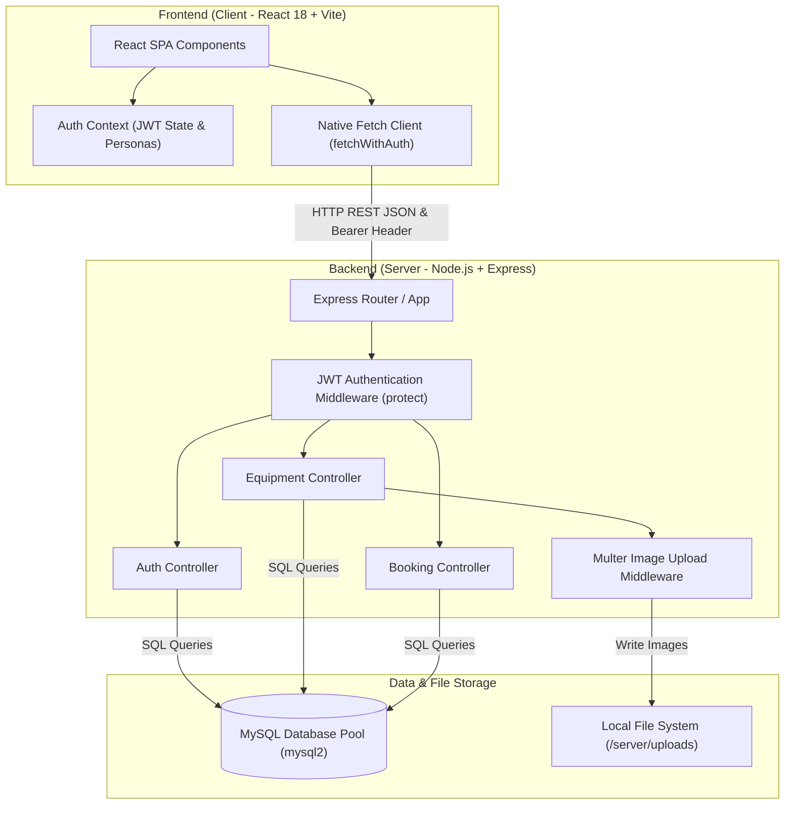

# 🌾 AgriRent - Agricultural Equipment Rental Marketplace


AgriRent is a modern full-stack web application that connects **farmers** with **agricultural equipment owners**, enabling seamless rental of machinery such as tractors, harvesters, tillers, seeders, and sprayers.

---

## 📌 Table of Contents

- [About](#-about)
- [Live Demo](#-live-demo)
- [Completed Core Modules](#-completed-core-modules)
- [Technology Stack](#-technology-stack)
- [System Architecture](#-system-architecture)
- [Project Folder Structure](#-project-folder-structure)
- [Installation & Setup](#-installation--setup)
- [Environment Variables](#-environment-variables)
- [API Documentation](#-api-documentation)
- [Testing](#-testing)
- [Deployment](#-deployment)
- [Future Enhancements](#-future-enhancements)
- [License](#-license)
- [Author / Contact](#-author--contact)

---

## 🌱 About

AgriRent empowers farmers by providing affordable, direct access to farming machinery without heavy capital investments. Equipment owners can monetize their unused machinery by listing equipment for rent, setting daily rates, and accepting rental requests.

---

## 🌐 Live Demo

Not deployed yet. Production deployment is planned for Capstone Review-II.

---

## ✅ Completed Core Modules

1. **Authentication & User Management**:
   - Account Registration & Login with role selection (`farmer`, `owner`, `admin`)
   - Secure password hashing with `bcrypt` / `bcryptjs`
   - Stateless session handling with JWT bearer tokens
   - Client-side route protection using `<ProtectedRoute>` guards

2. **Equipment Management**:
   - Create, Read, Update, and Delete (CRUD) operations for agricultural machinery
   - Multi-parameter catalog search, location filtering, and category selection
   - Detailed machinery view with specifications, fuel type, horsepower, and driver availability
   - Image upload handling via `multer` storing files in server `/uploads` directory

3. **Booking & Reservation Management**:
   - Interactive rental date selection and driver inclusion option
   - Real-time rental duration and total cost estimation
   - Date range conflict validation (`hasBookingConflict`) preventing double-booking
   - Farmer Dashboard for tracking rental request status and cancellation
   - Owner Dashboard for reviewing incoming requests with Accept/Reject actions

### ⏳ Planned / Future Modules
- Payment Gateway Integration (Stripe / Razorpay escrow webhooks)
- Review & Rating System (Post-rental farmer ratings & commentary)
- Notifications System (In-app alert drawer & automated SMTP email dispatch)
- Production Cloud Deployment (Capstone Review-II)

---

## 🛠 Technology Stack

### Frontend
- **Framework**: React 18 + Vite
- **Routing**: React Router DOM v6.22.3 (`AppRoutes.jsx`, `ProtectedRoute`)
- **State Management**: React Context (`AuthContext.jsx` for JWT & demo personas)
- **Styling**: Tailwind CSS & Lucide Icons
- **HTTP Client**: Native Fetch API (`fetchWithAuth` in `client/src/services/api.js`)

### Backend
- **Runtime**: Node.js
- **Framework**: Express.js REST API
- **Database**: MySQL 8.0 (`mysql2/promise` connection pool in `server/config/db.js`)
- **Authentication & Security**: JSON Web Tokens (`jsonwebtoken`), `bcrypt` / `bcryptjs`, RBAC authorization middleware (`protect`, `authorizeRoles`)
- **File Upload**: Multer (Local disk storage in `/server/uploads`)

### Version Control & Documentation
- **Version Control**: Git & GitHub
- **System Documentation**: Markdown & Mermaid ER/Architecture specifications (`docs/diagrams/`)

---

## 🏗 System Architecture

For detailed architectural specifications, ER diagrams, and module interactions, refer to the official repository documentation:
- 🏛️ [System Architecture Specification](docs/diagrams/architecture.md)
- 🧩 [Layered Module & Class Diagram](docs/diagrams/module-diagram.md)
- 🗄️ [Entity-Relationship (ER) Diagram](docs/diagrams/er-diagram.md)



---

## 📁 Project Folder Structure

```
AgriRent/
├── .env.example
├── .gitignore
├── CHANGELOG.md
├── CONTRIBUTING.md
├── LICENSE
├── Problem_Statement.md
├── README.md
├── client/                     # Frontend App (React 18 + Vite)
│   ├── public/                 # Static public assets
│   ├── src/
│   │   ├── assets/             # Brand logos & icons
│   │   ├── components/         # Reusable UI components (Navbar, Footer, EquipmentCard, SearchBar)
│   │   ├── context/            # React Context (AuthContext.jsx)
│   │   ├── layouts/            # Page layouts (MainLayout, DashboardLayout)
│   │   ├── pages/              # Views (Home, Login, Register, Equipment, FarmerDashboard, OwnerDashboard, Booking, Profile)
│   │   ├── routes/             # Client routes & guards (AppRoutes.jsx, ProtectedRoute)
│   │   ├── services/           # API services (api.js, authService.js, equipmentService.js, bookingService.js)
│   │   ├── styles/             # Global stylesheets
│   │   ├── App.jsx             # Root React component
│   │   ├── App.css
│   │   ├── index.css
│   │   └── main.jsx            # React DOM entry point
│   ├── package.json
│   ├── tailwind.config.js
│   └── vite.config.js
├── docs/                       # Project Documentation & Diagrams
│   ├── api/
│   ├── architecture/
│   ├── database/
│   ├── diagrams/
│   │   ├── architecture.md    # Architecture specification
│   │   ├── module-diagram.md  # Module and class diagram
│   │   ├── er-diagram.md      # Verified ER diagram
│   │   └── 04_er_diagram.md
│   ├── schema.dbml            # DBML schema definition
│   └── screenshots/
└── server/                     # Backend App (Express + MySQL)
    ├── config/
    │   ├── db.js              # MySQL connection pool configuration
    │   └── schema.sql         # DDL script for database setup
    ├── controllers/           # Controllers (authController, equipmentController, bookingController, userController)
    ├── middleware/            # Middleware (authMiddleware, uploadMiddleware, errorMiddleware)
    ├── models/                # MySQL Model classes (User, Category, Equipment, Booking, Payment, Review, Notification)
    ├── routes/                # Express API routes (authRoutes, equipmentRoutes, bookingRoutes, userRoutes)
    ├── seed/                  # Seed scripts & sample equipment data
    ├── services/              # Business logic helpers (bookingService.js)
    ├── uploads/               # Stored equipment image uploads
    ├── utils/                 # Utilities (validator.js)
    ├── .env
    ├── .env.example
    ├── app.js                 # Express server configuration
    ├── server.js              # Server entry point
    └── package.json
```

---

## 📸 Screenshots

Screenshots will be added to this section before final submission.

---

## 🚀 Installation & Setup

### Prerequisites
- Node.js (v18+)
- MySQL Server 8.0+

### Database Setup
1. Start your local MySQL server.
2. The backend connects using settings in `server/.env`. On server startup (`npm run dev`), `server/config/db.js` automatically creates the `agrirent` database and executes `server/config/schema.sql` if tables do not exist.

### Backend Setup
1. Navigate to the `server` directory:
   ```bash
   cd server
   ```
2. Install dependencies:
   ```bash
   npm install
   ```
3. Configure environment variables in `server/.env` (see template below).
4. Start development server:
   ```bash
   npm run dev
   ```

### Frontend Setup
1. Navigate to the `client` directory:
   ```bash
   cd client
   ```
2. Install dependencies:
   ```bash
   npm install
   ```
3. Configure environment variables in `client/.env` (see template below).
4. Start development server:
   ```bash
   npm run dev
   ```

---

## 🔐 Environment Variables

### Backend Environment Variables (`server/.env`)
```env
PORT=5000
MYSQL_HOST=localhost
MYSQL_PORT=3306
MYSQL_USER=root
MYSQL_PASSWORD=your_mysql_password
MYSQL_DATABASE=agrirent
JWT_SECRET=your_jwt_secret_key
```

### Frontend Environment Variables (`client/.env`)
```env
VITE_API_BASE_URL=http://localhost:5000/api
```

---

## 📡 API Documentation

### Authentication API
- `POST /api/auth/register` - Register a new user (`farmer` or `owner`)
- `POST /api/auth/login` - Authenticate user & receive JWT token
- `GET /api/auth/profile` - Fetch authenticated user profile (Protected: Bearer Token)

### Equipment Management API
- `GET /api/equipment` - Fetch equipment catalog (supports `search`, `category`, `location`, `isDriverAvailable` filters)
- `GET /api/equipment/:id` - Fetch detailed specifications of a machine
- `GET /api/equipment/my` - Fetch owner's listed equipment (Protected: Owner/Admin)
- `POST /api/equipment` - Create a new machinery listing with image upload (Protected: Owner/Admin)
- `PUT /api/equipment/:id` - Update an equipment listing (Protected: Owner/Admin)
- `DELETE /api/equipment/:id` - Delete an equipment listing (Protected: Owner/Admin)

### Booking Management API
- `POST /api/bookings` - Submit a new rental booking request (Protected: Farmer/Admin)
- `GET /api/bookings/my` - Fetch logged-in farmer's rental bookings (Protected)
- `GET /api/bookings/owner` - Fetch incoming booking requests for owner's fleet (Protected: Owner/Admin)
- `GET /api/bookings/all` - Fetch all platform bookings (Protected: Admin)
- `GET /api/bookings/:id` - Fetch single booking record details (Protected)
- `PUT /api/bookings/:id/approve` - Approve a rental booking request (Protected: Owner/Admin)
- `PUT /api/bookings/:id/reject` - Decline a rental booking request (Protected: Owner/Admin)
- `PUT /api/bookings/:id/cancel` - Cancel a pending booking request (Protected: Farmer/Owner/Admin)
- `PUT /api/bookings/:id/status` - Update booking status generically (Protected)

---

## 🧪 Testing

Current Review-I verification includes:
- Manual frontend end-to-end flow testing
- PowerShell / API endpoint verification
- Authentication & JWT token validation
- Equipment CRUD and image upload testing
- Booking workflow & date overlap conflict verification
- MySQL RDBMS connection & schema verification
- Production frontend build compilation verification (`npm run build`)

*Automated test suite: Planned for a later capstone phase.*

---

## 🚀 Deployment

Current status:
- Local development environment fully verified for Capstone Review-I.
- Production/cloud deployment is planned for Capstone Review-II.

---

## 📅 Future Enhancements

- 💳 Payment Gateway Integration (Stripe / Razorpay escrow webhooks)
- ⭐ Review & Rating System (Farmer feedback & average ratings)
- 🔔 Notifications System (In-app alerts & SMTP email reminders)
- ☁️ Cloud Storage Integration (Cloudinary / AWS S3 for media assets)
- 🚀 Production Cloud Deployment & CI/CD Pipeline (Capstone Review-II)

---

## 📄 License

This project is licensed under the MIT License. See the [LICENSE](LICENSE) file for details.

---

## 👥 Author / Contact

Developed by the AgriRent Capstone Project Team.
