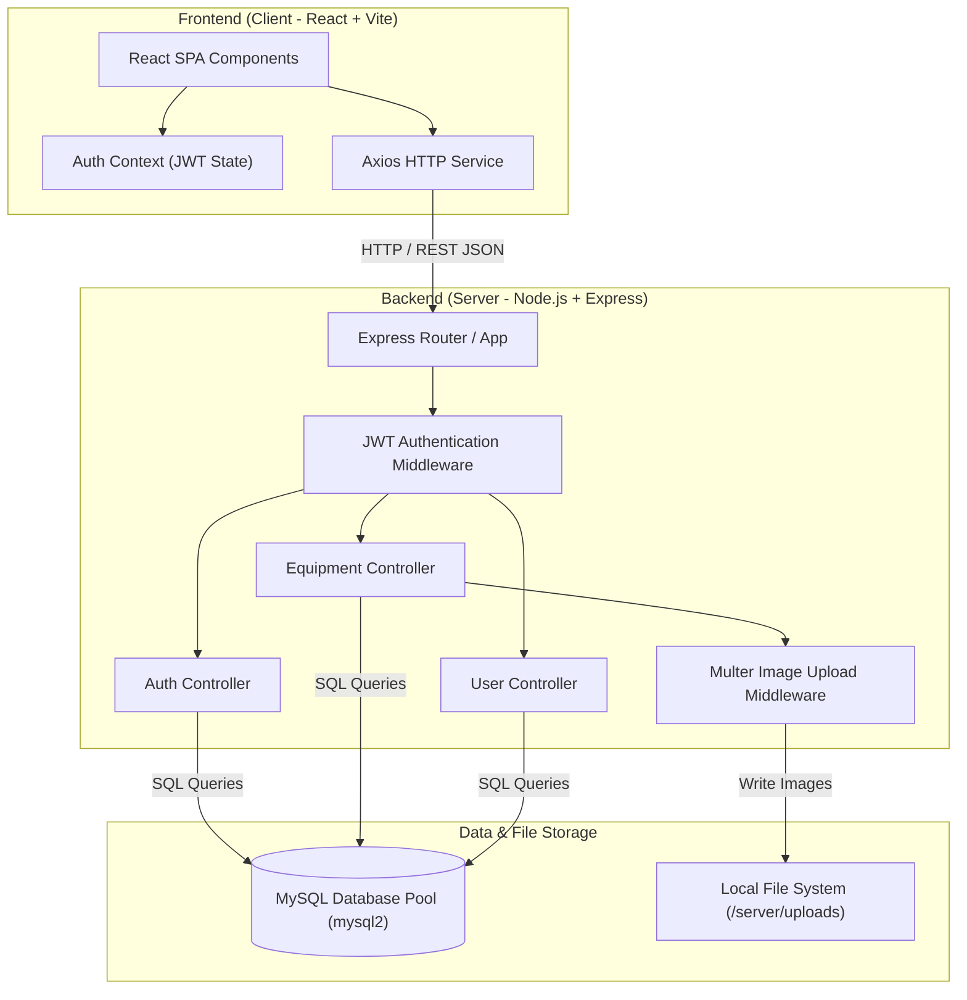
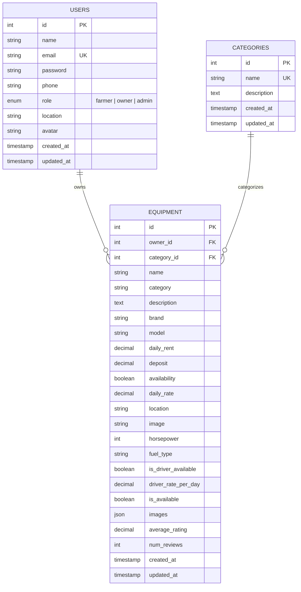

# 🌾 AgriRent - Agricultural Equipment Rental Marketplace


AgriRent is a modern full-stack web application that connects **farmers** with **agricultural equipment owners**, enabling seamless rental of machinery such as tractors, harvesters, tillers, seeders, and sprayers.

---

# 📌 Table of Contents

- [About](#-about)
- [Completed Modules](#-completed-modules)
- [Technology Stack](#-technology-stack)
- [Project Folder Structure](#-project-folder-structure)
- [System Architecture Diagram](#-system-architecture-diagram)
- [ER Diagram](#-er-diagram)
- [Database Schema Diagram](#-database-schema-diagram)
- [Installation & Setup](#-installation--setup)
- [API Endpoints](#-api-endpoints)
- [Roadmap & Status](#-roadmap--status)

---

# 🌱 About

AgriRent empowers farmers by providing affordable, direct access to farming machinery without heavy capital investments. Equipment owners can monetize their unused machinery by listing equipment for rent.

---

# ✅ Completed Modules

1. **Authentication & Authorization**:
   - User Registration & Login (Farmer, Owner, Admin roles)
   - Password hashing with `bcrypt`
   - Secure JWT token handling & route protection middleware
2. **Equipment Management**:
   - Create, Read, Update, and Delete (CRUD) operations for equipment
   - Category selection, daily rental rate calculation, and location filtering
3. **MySQL Database**:
   - Relational MySQL schema with foreign keys, index optimization, and transaction-safe connection pool (`mysql2`)
4. **JWT Authentication**:
   - Stateless session management with bearer tokens and role authorization middleware
5. **Image Upload**:
   - Multipart form processing with `multer` for uploading and hosting equipment photos

*(Note: Booking, Payment, and Notification modules are planned for subsequent development phases.)*

---

# 🛠 Technology Stack

### Frontend
- **Framework**: React 19 + Vite
- **Styling**: Tailwind CSS
- **Routing**: React Router DOM v7
- **HTTP Client**: Axios

### Backend
- **Runtime**: Node.js
- **Framework**: Express.js
- **Database**: MySQL 8.0 (`mysql2` connection pool)
- **Auth**: JSON Web Tokens (`jsonwebtoken`), `bcrypt`
- **File Storage**: Multer (Static uploads directory)

---

# 📁 Project Folder Structure

```
AgriRent/
├── .env.example
├── .gitignore
├── CHANGELOG.md
├── CONTRIBUTING.md
├── LICENSE
├── Problem_Statement.md
├── README.md
├── client/                     # Frontend App (React + Vite)
│   ├── public/                 # Static assets
│   ├── src/
│   │   ├── assets/             # Brand logos & icons
│   │   ├── components/         # Reusable UI components (Navbar, Footer, EquipmentCard, Hero)
│   │   ├── context/            # React Context (AuthContext.jsx)
│   │   ├── layouts/            # Page layouts (MainLayout, DashboardLayout)
│   │   ├── pages/              # Views (Home, Login, Register, Equipment, Admin, Owner, Farmer)
│   │   ├── routes/             # Client routes (AppRoutes.jsx)
│   │   ├── services/           # API services (api.js, authService.js, equipmentService.js)
│   │   ├── styles/             # CSS design tokens & global stylesheets
│   │   ├── App.jsx             # Root React component
│   │   ├── App.css
│   │   ├── index.css
│   │   └── main.jsx            # React DOM entry point
│   ├── package.json
│   ├── tailwind.config.js
│   └── vite.config.js
├── docs/                       # Project Documentation & Diagrams
│   ├── api/
│   ├── architecture/
│   │   └── architecture.md    # Architecture specification
│   ├── database/
│   │   └── database.md        # Database ER diagram & schema doc
│   ├── diagrams/
│   │   ├── architecture.md
│   │   ├── database.md
│   │   └── workflow.md
│   ├── schema.dbml            # DBML definition for completed models
│   └── screenshots/
└── server/                     # Backend App (Express + MySQL)
    ├── config/
    │   ├── db.js              # MySQL connection pool configuration
    │   └── schema.sql         # DDL script for database setup
    ├── controllers/           # Controllers (authController, equipmentController, userController)
    ├── middleware/            # Middleware (authMiddleware, uploadMiddleware, errorMiddleware)
    ├── models/                # MySQL Model classes (User, Category, Equipment)
    ├── routes/                # Express API routes (authRoutes, equipmentRoutes, userRoutes)
    ├── seed/                  # Seed scripts & demo data
    ├── services/              # Business logic helpers
    ├── uploads/               # Stored equipment image uploads
    ├── utils/                 # Utilities (generateToken, validator)
    ├── validations/           # Input validation schemas
    ├── .env
    ├── .env.example
    ├── app.js                 # Express server configuration
    ├── server.js              # Server entry point
    └── package.json
```

---

# 🏗 System Architecture Diagram



---

# 📊 ER Diagram

> *Reflects current completed entities: Users, Categories, and Equipment.*



---

# 🗄 Database Schema Diagram

### 1. `users` Table
| Field | Type | Constraints | Description |
|---|---|---|---|
| `id` | INT | PK, AUTO_INCREMENT | Unique user identifier |
| `name` | VARCHAR(100) | NOT NULL | User's full name |
| `email` | VARCHAR(100) | UNIQUE, NOT NULL, INDEX | Email address |
| `password` | VARCHAR(255) | NOT NULL | Bcrypt hashed password |
| `phone` | VARCHAR(20) | NOT NULL | Contact phone number |
| `role` | ENUM('farmer','owner','admin') | NOT NULL, DEFAULT 'farmer', INDEX | Platform user role |
| `location` | VARCHAR(255) | DEFAULT '' | User location |
| `avatar` | VARCHAR(255) | DEFAULT '' | Profile picture URL |
| `created_at` | TIMESTAMP | DEFAULT CURRENT_TIMESTAMP | Creation timestamp |
| `updated_at` | TIMESTAMP | DEFAULT CURRENT_TIMESTAMP ON UPDATE | Last update timestamp |

### 2. `categories` Table
| Field | Type | Constraints | Description |
|---|---|---|---|
| `id` | INT | PK, AUTO_INCREMENT | Category ID |
| `name` | VARCHAR(50) | UNIQUE, NOT NULL | Category name |
| `description` | TEXT | NULLABLE | Category description |
| `created_at` | TIMESTAMP | DEFAULT CURRENT_TIMESTAMP | Creation timestamp |
| `updated_at` | TIMESTAMP | DEFAULT CURRENT_TIMESTAMP ON UPDATE | Last update timestamp |

### 3. `equipment` Table
| Field | Type | Constraints | Description |
|---|---|---|---|
| `id` | INT | PK, AUTO_INCREMENT | Equipment ID |
| `owner_id` | INT | FK (users.id), NOT NULL | Owner ID |
| `category_id` | INT | FK (categories.id), NULLABLE | Category ID |
| `name` | VARCHAR(150) | NOT NULL | Equipment title |
| `category` | VARCHAR(50) | NOT NULL, DEFAULT 'General', INDEX | Equipment category name |
| `description` | TEXT | NOT NULL | Description |
| `brand` | VARCHAR(100) | DEFAULT '' | Brand |
| `model` | VARCHAR(100) | DEFAULT '' | Model number |
| `daily_rent` | DECIMAL(10,2) | DEFAULT 0.00 | Daily rental cost |
| `deposit` | DECIMAL(10,2) | DEFAULT 0.00 | Security deposit |
| `availability` | TINYINT(1) | DEFAULT 1 | Availability flag |
| `daily_rate` | DECIMAL(10,2) | NOT NULL, DEFAULT 0.00 | Daily rate |
| `location` | VARCHAR(255) | NOT NULL, INDEX | Equipment location |
| `image` | VARCHAR(255) | DEFAULT '' | Main image file path |
| `horsepower` | INT | DEFAULT 0 | Horsepower (HP) |
| `fuel_type` | VARCHAR(50) | DEFAULT 'Diesel' | Fuel type |
| `is_driver_available` | TINYINT(1) | DEFAULT 0 | Optional driver inclusion |
| `driver_rate_per_day` | DECIMAL(10,2) | DEFAULT 0.00 | Extra driver daily rate |
| `is_available` | TINYINT(1) | DEFAULT 1 | System active status |
| `images` | JSON | NULLABLE | Extra image paths |
| `average_rating` | DECIMAL(3,2) | DEFAULT 0.00 | Rating average |
| `num_reviews` | INT | DEFAULT 0 | Review count |
| `created_at` | TIMESTAMP | DEFAULT CURRENT_TIMESTAMP | Creation timestamp |
| `updated_at` | TIMESTAMP | DEFAULT CURRENT_TIMESTAMP ON UPDATE | Last update timestamp |

---

# 🚀 Installation & Setup

### Prerequisites
- Node.js (v18+)
- MySQL Server 8.0+

### Backend Setup
1. Navigate to `server` directory:
   ```bash
   cd server
   ```
2. Install dependencies:
   ```bash
   npm install
   ```
3. Configure Environment Variables (`.env`):
   ```env
   PORT=5000
   MYSQL_HOST=localhost
   MYSQL_PORT=3306
   MYSQL_USER=root
   MYSQL_PASSWORD=your_password
   MYSQL_DATABASE=agrirent
   JWT_SECRET=your_jwt_secret_key
   ```
4. Start Server:
   ```bash
   npm run dev
   ```

### Frontend Setup
1. Navigate to `client` directory:
   ```bash
   cd client
   ```
2. Install dependencies:
   ```bash
   npm install
   ```
3. Start Development Server:
   ```bash
   npm run dev
   ```

---

# 📡 API Endpoints (Current Completed Modules)

### Authentication
- `POST /api/auth/register` - Register a new user (farmer or owner)
- `POST /api/auth/login` - Authenticate user & receive JWT token
- `GET /api/auth/me` - Fetch authenticated user profile

### Equipment Management
- `GET /api/equipment` - Fetch all equipment (supports filtering & search)
- `GET /api/equipment/:id` - Fetch single equipment details
- `POST /api/equipment` - Add new equipment listing (Owner only, with image upload)
- `PUT /api/equipment/:id` - Update equipment listing (Owner only)
- `DELETE /api/equipment/:id` - Delete equipment listing (Owner only)

---

# 📅 Roadmap & Status

- ✅ Project Structure & Configuration
- ✅ MySQL Database Setup
- ✅ JWT Authentication & User Management
- ✅ Equipment Management (CRUD & Filters)
- ✅ Image Upload Handling (Multer)
- ✅ Booking Module (Next Step)
- ⏳ Payments Module
- ⏳ Review & Rating System
- ⏳ Notifications System

---

# 📜 License

Distributed under the **MIT License**.
