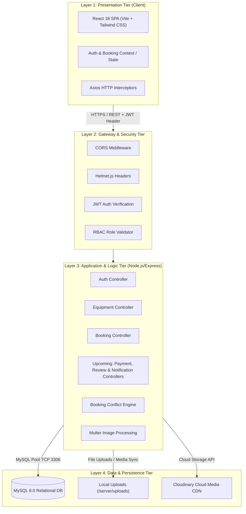
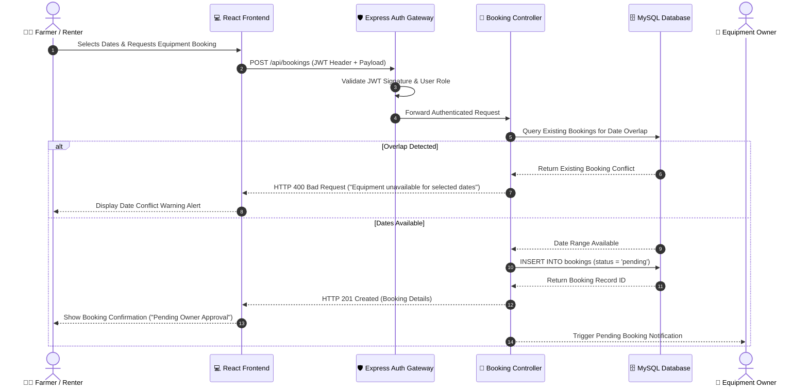

# High-Level Architecture (HLA) Document

**Project Name:** AgriRent – Agricultural Equipment Rental Marketplace  
**Document Version:** 1.0.0  
**Document Status:** Approved  
**Author:** Enterprise Solution Architect & Technical Documentation Team  
**Target Location:** `docs/architecture/02_high_level_architecture.md`  

---

## 1. Purpose

The purpose of this High-Level Architecture (HLA) document is to define the top-level structural design, component boundaries, module interactions, and technology stack for **AgriRent**—a peer-to-peer agricultural equipment rental marketplace. 

This document serves as the foundational architectural blueprint for:
* **Academic Reviewers & Panel Examiners:** Validating non-functional requirements, modularity, security, and software design principles for the final year Capstone Project.
* **Engineering Teams & Open Source Contributors:** Providing context on component responsibilities, data flow, security boundaries, and scalability considerations.

---

## 2. System Overview

AgriRent is designed to bridge the gap between smallholder farmers requiring specialized agricultural machinery (tractors, harvesters, seeders, tilling equipment) and equipment owners seeking to monetize idle farm assets.

### 2.1 Core Capabilities & Module Status

| Module | Scope / Capability | Development Status |
|---|---|---|
| **Authentication Module** | User registration, login, role assignment (Farmer/Owner/Admin), password hashing (bcrypt), and stateless session handling (JWT). | ✅ **Completed** |
| **Equipment Management Module** | Equipment catalog listing, search filtering (category, location, rental rate), image upload (Multer/Cloudinary), status toggling. | ✅ **Completed** |
| **Booking Management Module** | Date availability checking, booking request creation, owner approval/rejection workflow, booking cancellation and status transitions. | ✅ **Completed** |
| **Payment Management Module** | Escrow payments, transaction logging, online payment gateway integration (Stripe / Razorpay). | ⏳ *Upcoming / Future* |
| **Notification Management Module** | Real-time in-app alerts, email notifications (Nodemailer/SendGrid) for booking confirmations, reminders, and updates. | ⏳ *Upcoming / Future* |
| **Review & Rating Module** | Post-rental ratings and textual feedback for equipment and owners to establish marketplace trust score. | ⏳ *Upcoming / Future* |
| **Frontend Dashboard Module** | Analytics visualizations, earnings metrics, owner asset management portal, and admin governance overview. | ⏳ *Upcoming / Future* |

---

## 3. High-Level Architecture Diagram Placeholder

Below is the conceptual architecture layout.

```
+-----------------------------------------------------------------------------------+
|                            HIGH-LEVEL ARCHITECTURE DIAGRAM                        |
|                                                                                   |
|                               |
|                                                                                   |
|           *Note: The official PNG diagram asset is rendered and located at*       |
|                       `docs/diagrams/architecture.png`                            |
+-----------------------------------------------------------------------------------+
```

---

## 4. Architecture Layers & Tier Decomposition

AgriRent follows an **N-Tier Layered Architecture Pattern** adhering to strict separation of concerns across presentation, API routing, business logic, data persistence, and external services.



### 4.1 Layer 1: Presentation Tier (React Client)
- **Built With:** React.js, Vite, Tailwind CSS, Axios, Lucide React Icons.
- **Role:** Delivers a responsive Single Page Application (SPA) supporting multiple user personas (Farmers, Owners, Admins). It manages state client-side and communicates with the backend asynchronously using Axios REST requests.

### 4.2 Layer 2: API Gateway & Security Tier
- **Built With:** Express Middleware (`cors`, `helmet`, custom JWT verification).
- **Role:** Handles incoming request filtering, CORS policies, rate limiting, token extraction from `Authorization: Bearer <JWT>`, signature verification, and role-based route guard authorization.

### 4.3 Layer 3: Application & Business Logic Tier
- **Built With:** Node.js, Express.js Controller-Service Modules.
- **Role:** Encapsulates business logic including user credential authentication, equipment query parameter parsing, booking date collision prevention logic, and status transition validation.

### 4.4 Layer 4: Data & Media Persistence Tier
- **Built With:** MySQL 8.0 Engine (`mysql2` connection pool), Local Storage, Cloudinary CDN.
- **Role:** Guarantees relational data integrity, multi-table foreign key relationships, transaction isolation (ACID), and scalable media asset delivery.

---

## 5. Component Responsibilities Matrix

| Component | Class / File Path | Core Responsibility |
|---|---|---|
| **Auth Controller** | `server/controllers/authController.js` | User signup validation, password hashing via bcrypt, user login, JWT generation. |
| **Equipment Controller** | `server/controllers/equipmentController.js` | Listing creation, image processing, catalog retrieval, category filtering, search. |
| **Booking Controller** | `server/controllers/bookingController.js` | Booking request initiation, status updates (`pending`, `confirmed`, `cancelled`), date availability verification. |
| **User Controller** | `server/controllers/userController.js` | User profile retrieval, owner listing history, user profile management. |
| **JWT Middleware** | `server/middleware/authMiddleware.js` | Header token decoding, secret key verification, attaching user payload to `req.user`. |
| **Cloudinary Service** | `server/config/cloudinary.js` | Multer storage engine wrapper for direct Cloudinary image stream upload. |
| **Database Pool Config** | `server/config/db.js` | MySQL pool setup, promise wrapper initialization, error retry logic. |

---

## 6. Data Flow Overview



---

## 7. Technology Stack Summary

```
+--------------------------------------------------------------------+
|                         AGRIRENT TECH STACK                        |
+-------------------+------------------------------------------------+
| Layer             | Technologies Used                              |
+-------------------+------------------------------------------------+
| Frontend UI       | React.js 18, Vite, Tailwind CSS, Lucide Icons  |
| State & HTTP      | React Context API, Axios Interceptors          |
| Backend Runtime   | Node.js (v18+ LTS), Express.js (v4)            |
| Authentication    | JSON Web Tokens (jsonwebtoken), bcryptjs       |
| Database Engine   | MySQL 8.0 Community Server, mysql2 Driver      |
| File Handling     | Multer Multipart Parser, Cloudinary SDK        |
| Version Control   | Git, GitHub Repository                         |
| Dev Tools         | Postman, VS Code, ESLint, Nodemon              |
+-------------------+------------------------------------------------+
```

---

## 8. Security Architecture

1. **Authentication & Authorization:**
   - Stateless JWT tokens stored client-side in secure HTTP-only / LocalStorage context.
   - Passwords hashed using salt rounds via `bcrypt.hash()` prior to storage.
   - Role-Based Access Control (RBAC) enforcing explicit privileges (`farmer`, `owner`, `admin`).
2. **Input Sanitation & Security Headers:**
   - Parameterized SQL queries using `mysql2` prepared statements to prevent **SQL Injection (SQLi)**.
   - `helmet` middleware setting strict HTTP response headers against Cross-Site Scripting (XSS) and Clickjacking.
   - Express `cors` configuration permitting requests only from whitelisted client origins.
3. **Sensitive Data Protection:**
   - Secrets (`JWT_SECRET`, `DB_PASSWORD`, `CLOUDINARY_SECRET`) managed via environment variables (`.env`) and kept out of source control (`.gitignore`).

---

## 9. Scalability & Non-Functional Considerations

* **Stateless API Design:** Express backend services maintain zero session state, allowing horizontal auto-scaling behind a load balancer (e.g., NGINX / AWS ALB).
* **Database Connection Pooling:** MySQL connection pooling (`mysql2.createPool()`) recycles database connections, supporting concurrent user traffic without exhaustion.
* **CDN Media Delivery:** Uploaded images offloaded to Cloudinary CDN ensure fast global asset caching without clogging backend server bandwidth.
* **Indexing Strategy:** Database indexes placed on frequently queried foreign key fields (`owner_id`, `category_id`, `equipment_id`, `status`) guarantee sub-50ms search query responses.

---

## 10. Future Enhancements

1. **Payment Escrow Gateway:** Integration with Razorpay/Stripe API for automatic payout hold until rental completion.
2. **Real-Time Websocket Notifications:** Implementation of Socket.io for instantaneous booking status change updates.
3. **Geo-Spatial Search:** MySQL spatial index implementation enabling radial distance search (e.g., "Equipment within 20 km of Farmer location").
4. **AI Price Recommendation Engine:** Machine learning microservice analyzing seasonal demand to suggest optimal rental pricing to owners.

---

## 11. Verification & Document Control

| Revision | Date | Description | Author | Approved By |
|---|---|---|---|---|
| v1.0.0 | 2026-08-06 | Initial Enterprise High-Level Architecture Specification | Solution Architect | Capstone Panel |
