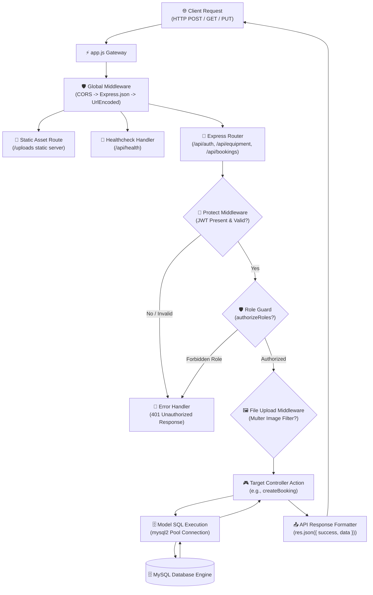

# Low-Level Architecture (LLA) Document

**Project Name:** AgriRent – Agricultural Equipment Rental Marketplace  
**Document Version:** 1.0.0  
**Document Status:** Approved  
**Author:** Technical Documentation Engineer & Core Backend Architect  
**Target Location:** `docs/architecture/03_low_level_architecture.md`  

---

## 1. Purpose & Scope

The purpose of this Low-Level Architecture (LLA) document is to detail the internal structural design, class/module interfaces, execution pipelines, request/response lifecycles, and database interactions for the **AgriRent Node.js/Express backend**.

This document serves as an exhaustive reference for backend engineers, system maintainers, and capstone evaluators. It covers the 3 completed core modules (**Authentication**, **Equipment Management**, and **Booking Management**), details shared infrastructure middleware, and establishes placeholder contracts for upcoming modules (**Payment**, **Notification**, and **Review**).

---

## 2. Directory & Folder-Wise Architecture

The AgriRent backend repository follows a modular Controller-Service-Model design pattern:

```
server/
├── app.js                      # Express application instantiation & middleware registration
├── server.js                   # Server bootstrapper & port listener initialization
├── config/
│   ├── db.js                   # MySQL connection pool instantiation (mysql2/promise)
│   └── cloudinary.js           # Cloudinary SDK & Multer storage configuration
├── controllers/
│   ├── authController.js       # User signup, login, profile authentication logic
│   ├── equipmentController.js  # Equipment CRUD, search filtering, category mapping
│   ├── bookingController.js    # Booking creation, status transitions & date availability
│   └── userController.js       # Profile management and user dashboard analytics
├── middleware/
│   ├── authMiddleware.js       # JWT signature verification & RBAC role guards
│   ├── errorMiddleware.js      # Global 404 handler and central error response middleware
│   └── uploadMiddleware.js     # Multer file upload filter and destination config
├── models/
│   ├── User.js                 # User SQL queries & data access abstraction
│   ├── Category.js             # Equipment category database model methods
│   ├── Equipment.js            # Equipment listing SQL query engine
│   ├── Booking.js              # Booking reservation SQL methods & transaction handlers
│   ├── Payment.js              # (Placeholder) Transaction database methods
│   ├── Review.js               # (Placeholder) Rating database query methods
│   └── Notification.js         # (Placeholder) Notification persistence model
├── routes/
│   ├── authRoutes.js           # Auth endpoints (/api/auth)
│   ├── equipmentRoutes.js      # Equipment endpoints (/api/equipment)
│   ├── bookingRoutes.js        # Booking endpoints (/api/bookings)
│   └── userRoutes.js           # Profile endpoints (/api/users)
├── services/                   # Business logic helpers & external integrations
├── utils/
│   ├── generateToken.js        # JWT token generation helper (jsonwebtoken)
│   └── apiResponse.js          # Standardized HTTP response formatter
└── validations/                # Joi / custom payload validation schema rules
```

---

## 3. Low-Level Architecture Diagram Placeholder

```
+-----------------------------------------------------------------------------------+
|                            LOW-LEVEL ARCHITECTURE DIAGRAM                         |
|                                                                                   |
|                                 |
|                                                                                   |
|           *Note: The official PNG diagram asset is rendered and located at*       |
|                       `docs/diagrams/low_level_architecture.png`                  |
+-----------------------------------------------------------------------------------+
```

---

## 4. End-to-End API Request Lifecycle

Every HTTP request sent to the AgriRent API passes through a predictable execution pipeline:



---

## 5. Execution Flows & Internal Mechanisms

### 5.1 JWT Authentication Flow
1. Client submits credentials to `POST /api/auth/login`.
2. `authController.js` calls `User.findByEmail(email)`.
3. If user exists, `bcrypt.compare(password, user.password)` verifies hash integrity.
4. Upon match, `generateToken(user.id)` creates a JWT signed with `JWT_SECRET` and expiration (`JWT_EXPIRES_IN`).
5. Client receives JSON payload with JWT string and stores it in `LocalStorage`.
6. Subsequent requests attach token in HTTP header: `Authorization: Bearer <token>`.

### 5.2 Authorization Flow (Role-Based Access Control - RBAC)
1. `protect` middleware extracts Bearer token, verifies signature via `jwt.verify()`, and attaches payload to `req.user`.
2. `authorizeRoles('owner', 'admin')` generates a closure checking if `req.user.role` matches allowed roles.
3. If authorized, `next()` transfers control to controller action.
4. If unauthorized, returns HTTP status `403 Forbidden` (`{ success: false, message: "User role 'farmer' is not authorized to access this resource" }`).

### 5.3 MySQL Connection Pooling Flow
1. `config/db.js` initializes `mysql2/promise` pool with configurable parameters (`host`, `user`, `password`, `database`, `connectionLimit: 10`, `waitForConnections: true`).
2. Model functions invoke `pool.query(sql, [params])`.
3. The pool checks out an available thread, executes prepared statement with SQL injection prevention, and returns results.
4. The thread is automatically returned to the pool, preventing memory/socket exhaustion.

### 5.4 File Upload Flow (Multer & Cloudinary)
1. Multipart request sent to `POST /api/equipment` with image payload.
2. `multer` middleware interceptor checks file MIME type (`image/jpeg`, `image/png`, `image/webp`).
3. Images are buffered locally into `/server/uploads` or directly streamed via Cloudinary API storage engine (`config/cloudinary.js`).
4. Cloudinary returns secure HTTPS CDN URL (`https://res.cloudinary.com/...`).
5. Controller saves image CDN URL string in MySQL `equipment.image_url` column.

### 5.5 Global Error Handling Flow
1. Unhandled route targets fall through to `notFound` middleware, returning `404 Not Found`.
2. Controller errors in try/catch blocks call `next(error)`.
3. Central `errorHandler` middleware formats error stack, maps HTTP status (default 500), and outputs standardized JSON:

```json
{
  "success": false,
  "message": "Resource not found",
  "stack": "Error: Resource not found\n    at equipmentController.js:42:15"
}
```

---

## 6. Detailed Backend Module Architecture

### 6.1 Authentication Module Architecture
* **Routes:** `server/routes/authRoutes.js`
  - `POST /api/auth/register` (Public) - Register new user (Farmer / Owner).
  - `POST /api/auth/login` (Public) - Authenticate and return JWT token.
  - `GET /api/auth/me` (Private) - Retrieve current authenticated profile.
* **Controller:** `server/controllers/authController.js` (`registerUser`, `loginUser`, `getMe`).
* **Model:** `server/models/User.js` (`create`, `findByEmail`, `findById`).
* **Request Lifecycle:**
  - Client -> `POST /api/auth/register` -> `registerUser` -> Hash password via `bcrypt` -> `User.create()` -> Return user object + JWT.

### 6.2 Equipment Management Module Architecture
* **Routes:** `server/routes/equipmentRoutes.js`
  - `GET /api/equipment` (Public) - Browse equipment with search/category filters.
  - `GET /api/equipment/:id` (Public) - Get detailed equipment metadata.
  - `POST /api/equipment` (Private: Owner/Admin) - Create new equipment listing with Multer upload.
  - `PUT /api/equipment/:id` (Private: Owner/Admin) - Update listing details.
  - `DELETE /api/equipment/:id` (Private: Owner/Admin) - Remove listing.
* **Controller:** `server/controllers/equipmentController.js` (`getAllEquipment`, `getEquipmentById`, `createEquipment`, `updateEquipment`, `deleteEquipment`).
* **Model:** `server/models/Equipment.js` & `server/models/Category.js`.
* **Request Lifecycle:**
  - Owner Client -> `POST /api/equipment` (with Multer file) -> `protect` -> `authorizeRoles('owner')` -> `createEquipment` -> Cloudinary upload -> `Equipment.create()` -> Return HTTP 201 Created.

### 6.3 Booking Management Module Architecture
* **Routes:** `server/routes/bookingRoutes.js`
  - `POST /api/bookings` (Private: Farmer) - Reserve equipment for date range.
  - `GET /api/bookings/my` (Private: Farmer/Owner) - View my active booking requests.
  - `GET /api/bookings/owner` (Private: Owner) - View incoming rental requests for owned assets.
  - `PUT /api/bookings/:id/approve` (Private: Owner/Admin) - Approve pending booking.
  - `PUT /api/bookings/:id/reject` (Private: Owner/Admin) - Reject pending booking request.
  - `PUT /api/bookings/:id/cancel` (Private: Farmer/Owner) - Cancel booking reservation.
* **Controller:** `server/controllers/bookingController.js`.
* **Model:** `server/models/Booking.js` (`checkAvailability`, `create`, `findById`, `updateStatus`).
* **Inter-Module Communication:**
  - Booking module references `Equipment.findById()` to verify daily rental rates and owner ID before writing booking reservation record.

---

## 7. Upcoming / Future Module Specifications (Placeholders)

### 7.1 Payment Management Module Architecture (Upcoming)
* **Target Routes:** `server/routes/paymentRoutes.js` (`POST /api/payments/checkout`, `POST /api/payments/webhook`).
* **Target Controller:** `server/controllers/paymentController.js`.
* **Target Model:** `server/models/Payment.js`.
* **Integration Strategy:** Will intercept approved bookings, calculate total cost (`daily_rate * duration_days`), invoke Razorpay/Stripe checkout API, and handle asynchronous webhook verification to transition booking state to `paid`.

### 7.2 Notification Management Module Architecture (Upcoming)
* **Target Routes:** `server/routes/notificationRoutes.js` (`GET /api/notifications`, `PATCH /api/notifications/:id/read`).
* **Target Controller:** `server/controllers/notificationController.js`.
* **Target Model:** `server/models/Notification.js`.
* **Integration Strategy:** Triggered asynchronously by `bookingController` and `paymentController` events to generate in-app alerts and dispatch email notifications via Nodemailer SMTP.

### 7.3 Review & Rating Module Architecture (Upcoming)
* **Target Routes:** `server/routes/reviewRoutes.js` (`POST /api/reviews`, `GET /api/reviews/equipment/:id`).
* **Target Controller:** `server/controllers/reviewController.js`.
* **Target Model:** `server/models/Review.js`.
* **Integration Strategy:** Allows farmers to post ratings (1-5 stars) and comments ONLY after booking status reaches `completed`. Updates aggregate average rating in `equipment` table.

---

## 8. Verification & Document Control

| Revision | Date | Description | Author | Approved By |
|---|---|---|---|---|
| v1.0.0 | 2026-08-06 | Initial Low-Level Architecture Specification | Technical Architect | Engineering Lead |
