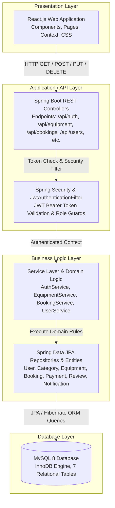

# High-Level Architecture

## Overview

The high-level architecture of **AgriRent** organizes the system into four major functional layers: **Presentation Layer**, **Application / API Layer**, **Business Logic Layer**, and **Database Layer**. This structure ensures clean separation of concerns and maintainability.

---

## High-Level Layer Diagram

---

## Detailed Layer Descriptions

### 1. Presentation Layer (React Frontend)
- **Technologies:** React.js, React Router DOM, Vite, CSS3, Axios.
- **Functionality:** 
  - Renders user interfaces such as the Equipment Catalog, Booking Form, Dashboard views, and Auth Forms.
  - Manages frontend client state using React Hooks (`useState`, `useEffect`) and Context API (`AuthContext`).
  - Formats user actions into JSON payloads and dispatches asynchronous HTTP requests to the backend Spring Boot REST endpoints.

### 2. Application / API Layer (Spring Web & Security)
- **Technologies:** Java 17+, Spring Boot 3.x, Spring Security, JJWT (`jjwt-api`).
- **Functionality:**
  - Serves as the single entry point for all API calls coming from the React client on port 8080.
  - Spring MVC RestControllers (`AuthController`, `EquipmentController`, `BookingController`, `UserController`, etc.) map incoming URLs and HTTP methods.
  - Intercepts requests using `JwtAuthenticationFilter` to verify Bearer JWT tokens in the `Authorization` header.
  - Evaluates user role permissions using `@PreAuthorize("hasAnyRole('farmer', 'owner', 'admin')")` or SecurityFilterChain rules before delegating to services.

### 3. Business Logic Layer (Spring Services & Data JPA)
- **Technologies:** Spring Boot Services, Spring Data JPA, Hibernate ORM, Bean Validation.
- **Functionality:**
  - Contains core business rules, such as calculating total booking amounts (daily rate × days + optional driver fee), updating equipment availability, verifying ownership before allowing modifications, and calculating average ratings from user reviews.
  - Controllers validate DTOs with `@Valid`, invoke service methods, handle edge cases via `GlobalExceptionHandler`, and return structured JSON responses (e.g., `{ success: true, data: [...] }`).
  - JPA Entities map database tables to Java objects with Lombok getters/setters.

### 4. Database Layer (MySQL 8)
- **Technologies:** MySQL 8.0, InnoDB storage engine, HikariCP connection pool (via Spring Data JPA).
- **Functionality:**
  - Stores all persistent data in 7 relational tables (`users`, `categories`, `equipment`, `bookings`, `payments`, `reviews`, `notifications`).
  - Enforces entity integrity and relational constraints using Foreign Keys with `CASCADE` or `SET NULL` actions.
  - Implements indexing on frequently queried columns (`email`, `role`, `owner_id`, `start_date`, `end_date`, `status`) to optimize query execution.
