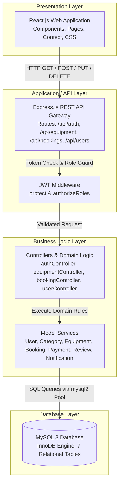

# High-Level Architecture

## Overview

The high-level architecture of **AgriRent** organizes the system into four major functional layers: **Presentation Layer**, **Application / API Layer**, **Business Logic Layer**, and **Database Layer**. This structure ensures clean separation of concerns and maintainability.

---

## High-Level Layer Diagram

---

## Detailed Layer Descriptions

### 1. Presentation Layer (React Frontend)
- **Technologies:** React.js, React Router DOM, CSS3, JavaScript (ES6+).
- **Functionality:** 
  - Renders user interfaces such as the Equipment Catalog, Booking Form, Dashboard views, and Auth Forms.
  - Manages frontend client state using React Hooks (`useState`, `useEffect`) and Context API (`AuthContext`).
  - Formats user actions (e.g., submitting a rental booking request) into JSON payloads and dispatches asynchronous HTTP requests to the backend REST endpoints.

### 2. Application / API Layer (Express Routing & Middleware)
- **Technologies:** Express.js, JSON Web Tokens (`jsonwebtoken`).
- **Functionality:**
  - Serves as the single entry point for all API calls coming from the React client.
  - Express routers (`authRoutes`, `equipmentRoutes`, `bookingRoutes`, `userRoutes`) parse incoming URLs and HTTP methods.
  - Intercepts requests using `protect` middleware to verify Bearer JWT tokens in the `Authorization` header.
  - Evaluates user role permissions using `authorizeRoles('farmer', 'owner', 'admin')` before delegating requests to controller actions.

### 3. Business Logic Layer (Controllers & Models)
- **Technologies:** Node.js JavaScript functions, custom Model abstractions.
- **Functionality:**
  - Contains core business rules, such as calculating total booking amounts (daily rate × days + optional driver fee), updating equipment availability, verifying ownership before allowing modifications, and calculating average ratings from user reviews.
  - Controllers validate input data, invoke model methods, handle edge cases, and send structured JSON responses (e.g., `{ success: true, data: [...] }`).
  - Models format SQL responses into JavaScript objects expected by the frontend.

### 4. Database Layer (MySQL 8)
- **Technologies:** MySQL 8.0, InnoDB storage engine, `mysql2` connection pool.
- **Functionality:**
  - Stores all persistent data in 7 relational tables (`users`, `categories`, `equipment`, `bookings`, `payments`, `reviews`, `notifications`).
  - Enforces entity integrity and relational constraints using Foreign Keys with `CASCADE` or `SET NULL` actions.
  - Implements indexing on frequently queried columns (`email`, `role`, `owner_id`, `start_date`, `end_date`, `status`) to optimize query execution.
