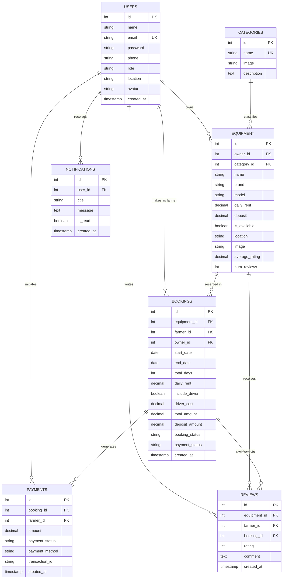
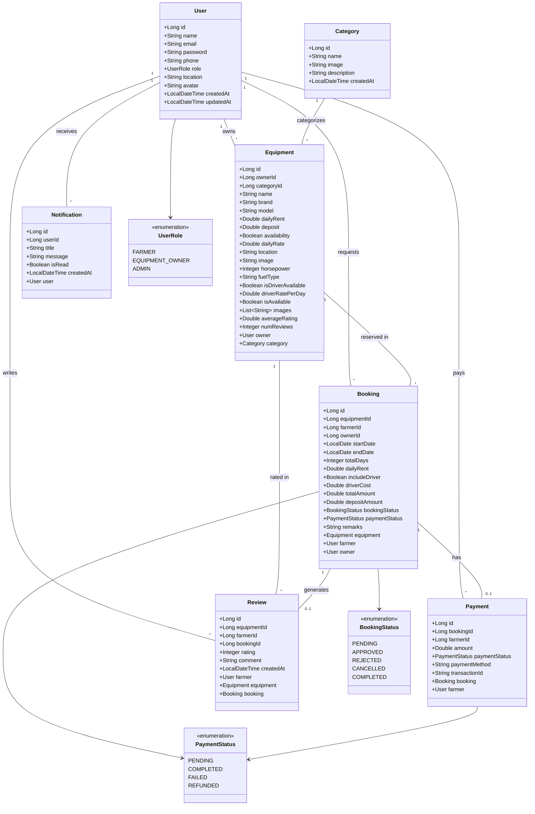

# Agricultural Equipment Rental Marketplace
## Professional Architecture, Database Schema, Class & Directory Specifications

> **Capstone Project Documentation Suite**  
> All diagrams are generated in high-resolution PNG format, SVG vector format, and Mermaid code format.

---

### 1. System Architecture Diagram


```mermaid
graph TD
    subgraph Client Tier
        UI["React SPA (React.js + Vanilla CSS)"]
        Router["React Router v6"]
        Axios["Axios Client + JWT Interceptors"]
    end

    subgraph API Gateway / Security Layer
        CORS["CORS Configuration"]
        AuthMW["JWT Authentication Middleware"]
        RoleMW["Role-Based Access Control (RBAC)"]
        MulterMW["Multer Image Upload Middleware"]
    end

    subgraph Controller Layer
        AuthCtrl["AuthController"]
        EquipCtrl["EquipmentController"]
        BookingCtrl["BookingController"]
        PaymentCtrl["PaymentController"]
        NotifCtrl["NotificationController"]
        ReviewCtrl["ReviewController"]
    end

    subgraph Service Layer / Business Logic
        AuthSvc["AuthService / bcrypt"]
        EquipSvc["EquipmentService / Search"]
        BookingSvc["BookingService / Conflict Engine"]
        PaymentSvc["PaymentService / Gateways"]
        NotifSvc["NotificationService / Email"]
        ReviewSvc["ReviewService / Rating Calculator"]
    end

    subgraph Data Access Layer (Models)
        UserRepo["UserModel"]
        CatRepo["CategoryModel"]
        EquipRepo["EquipmentModel"]
        BookingRepo["BookingModel"]
        PaymentRepo["PaymentModel"]
        NotifRepo["NotificationModel"]
        ReviewRepo["ReviewModel"]
    end

    subgraph Database Tier & Storage
        DB[("MySQL Database")]
        Storage["Local File Storage (uploads/)"]
    end

    UI --> Router
    Router --> Axios
    Axios -->|HTTP Requests / Bearer JWT| CORS
    CORS --> AuthMW
    AuthMW --> RoleMW
    RoleMW --> MulterMW
    MulterMW --> AuthCtrl & EquipCtrl & BookingCtrl & PaymentCtrl & NotifCtrl & ReviewCtrl

    AuthCtrl --> AuthSvc
    EquipCtrl --> EquipSvc
    BookingCtrl --> BookingSvc
    PaymentCtrl --> PaymentSvc
    NotifCtrl --> NotifSvc
    ReviewCtrl --> ReviewSvc

    AuthSvc --> UserRepo
    EquipSvc --> EquipRepo & CatRepo
    BookingSvc --> BookingRepo & EquipRepo
    PaymentSvc --> PaymentRepo & BookingRepo
    NotifSvc --> NotifRepo & UserRepo
    ReviewSvc --> ReviewRepo & EquipRepo

    UserRepo --> DB
    CatRepo --> DB
    EquipRepo --> DB
    BookingRepo --> DB
    PaymentRepo --> DB
    NotifRepo --> DB
    ReviewRepo --> DB
    EquipSvc --> Storage
```

---

### 2. Database Schema Diagram (ERD)




---

### 3. Class Diagram




---

### 4. Workspace Directory Structure


```text
AgriRent/
├── client/                     # Frontend React.js Single Page Application
│   ├── src/
│   │   ├── components/         # Reusable UI Components (Navbar, Footer, Equipment Card)
│   │   ├── pages/              # Views (Home, Login, Register, Catalog, Dashboard)
│   │   ├── routes/             # App Navigation & Protected Route Wrappers
│   │   ├── services/           # Axios HTTP Client & API Service calls
│   │   ├── context/            # Global Auth Context State Management
│   │   ├── layouts/            # Page Container Layouts
│   │   ├── App.jsx             # Main React Router component
│   │   └── main.jsx            # Application Entrypoint
│   ├── package.json
│   └── vite.config.js
│
├── server/                     # Backend Node.js & Express.js REST API
│   ├── config/                 # Database configuration (MySQL Pool)
│   ├── controllers/            # Request handlers (authController, equipmentController, bookingController)
│   ├── middleware/             # Express Middlewares (JWT Authentication, Multer Uploads)
│   ├── models/                 # MySQL Data Access Models (User, Category, Equipment, Booking)
│   ├── routes/                 # Express API Endpoint Routers
│   ├── validations/            # Request Body Sanitization & Validation Schemas
│   ├── uploads/                # Static Media File Storage
│   │   ├── equipment/          # Equipment Photo Storage
│   │   └── users/              # User Profile Avatar Storage
│   ├── app.js                  # Express Application Pipeline Configuration
│   ├── server.js               # HTTP Server Initialization
│   └── package.json
│
└── docs/                       # Project Technical Documentation & Architecture Artifacts
    ├── diagrams/               # High-Resolution Diagram Visuals & HTML/SVG Sources
    │   ├── architecture.png
    │   ├── database_schema.png
    │   ├── class_diagram.png
    │   └── directory_structure.png
    └── architecture/
        └── system_architecture.md
```
