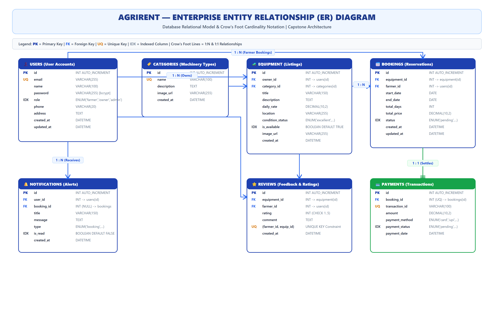

# AgriRent - Enterprise Entity-Relationship (ER) Diagram & Database Specification

**Project Name:** AgriRent – Agricultural Equipment Rental Marketplace  
**Document Version:** 1.0.0  
**Document Status:** Approved  
**Author:** Lead Database Architect & Software Architecture Team  
**Target Location:** `docs/diagrams/04_er_diagram.md`  
**Diagram Assets:** 
- Editable Source: [`docs/diagrams/er-diagram.drawio`](file:///c:/Users/sanja/OneDrive/Desktop/AgriRent/docs/diagrams/er-diagram.drawio)
- High-Res Vector SVG: [`docs/diagrams/er-diagram.svg`](file:///c:/Users/sanja/OneDrive/Desktop/AgriRent/docs/diagrams/er-diagram.svg)
- High-Res Image PNG: [`docs/diagrams/er-diagram.png`](file:///c:/Users/sanja/OneDrive/Desktop/AgriRent/docs/diagrams/er-diagram.png)

---

## 1. Executive Purpose

The purpose of this document is to specify the **Enterprise Entity-Relationship (ER) Diagram** for the **AgriRent** peer-to-peer agricultural equipment rental marketplace. This data model governs relational data storage, enforces database-level integrity constraints, and defines entity cardinalities across all 7 core tables: **`users`**, **`categories`**, **`equipment`**, **`bookings`**, **`payments`**, **`notifications`**, and **`reviews`**.

This document is engineered to meet strict standards required for:
* Final Year Capstone Project Technical Evaluation
* Enterprise Software Architecture Documentation
* GitHub Technical Portfolio Showcase
* Technical Viva & Database Placement Interviews

---

## 2. Enterprise ER Diagram Visualizations

### 2.1 High-Resolution ER Diagram View (SVG / PNG)



### 2.2 Mermaid ER Diagram Definition (Crow's Foot Notation)

```mermaid
erDiagram
    USERS ||--o{ EQUIPMENT : "owns (1:N)"
    CATEGORIES ||--o{ EQUIPMENT : "classifies (1:N)"
    EQUIPMENT ||--o{ BOOKINGS : "reserved_in (1:N)"
    USERS ||--o{ BOOKINGS : "creates (1:N)"
    BOOKINGS ||--|| PAYMENTS : "settles (1:1)"
    USERS ||--o{ NOTIFICATIONS : "receives (1:N)"
    BOOKINGS ||--o{ NOTIFICATIONS : "triggers (1:N)"
    EQUIPMENT ||--o{ REVIEWS : "rated_in (1:N)"
    USERS ||--o{ REVIEWS : "writes (1:N)"

    USERS {
        int id PK
        string email UQ
        string name
        string password
        enum role IDX
        string phone
        text address
        datetime created_at
    }

    CATEGORIES {
        int id PK
        string name UQ
        text description
        string image_url
        datetime created_at
    }

    EQUIPMENT {
        int id PK
        int owner_id FK
        int category_id FK
        string title
        text description
        decimal daily_rate
        string location
        enum condition_status
        boolean is_available IDX
        string image_url
        datetime created_at
    }

    BOOKINGS {
        int id PK
        int equipment_id FK
        int farmer_id FK
        date start_date
        date end_date
        int total_days
        decimal total_price
        enum status IDX
        datetime created_at
    }

    PAYMENTS {
        int id PK
        int booking_id FK_UQ
        string transaction_id UQ
        decimal amount
        enum payment_method
        enum payment_status IDX
        datetime payment_date
    }

    NOTIFICATIONS {
        int id PK
        int user_id FK
        int booking_id FK
        string title
        text message
        enum type
        boolean is_read IDX
        datetime created_at
    }

    REVIEWS {
        int id PK
        int equipment_id FK
        int farmer_id FK
        int rating
        text comment
        datetime created_at
    }
```

---

## 3. Comprehensive Database Entity Catalog

### 3.1 Entity: `users`
* **Purpose:** Stores user profiles and credentials for Farmers, Equipment Owners, and System Administrators.
* **Primary Key:** `id` (INT, AUTO_INCREMENT)
* **Unique Keys:** `email` (VARCHAR(255))
* **Indexed Fields:** `role` (`idx_users_role`)
* **Attributes & Constraints:**

| Column Name | Data Type | Nullable | Constraints & Defaults | Description |
|---|---|---|---|---|
| `id` | INT | NO | PRIMARY KEY, AUTO_INCREMENT | Unique user identifier |
| `email` | VARCHAR(255) | NO | UNIQUE, NOT NULL | Account email address |
| `name` | VARCHAR(100) | NO | NOT NULL | Full name of user |
| `password` | VARCHAR(255) | NO | NOT NULL | Bcrypt hashed password string |
| `role` | ENUM | NO | 'farmer', 'owner', 'admin' | User RBAC authority level |
| `phone` | VARCHAR(20) | YES | NULL | Contact phone number |
| `address` | TEXT | YES | NULL | Residential / farm location |
| `created_at` | DATETIME | NO | CURRENT_TIMESTAMP | Account creation timestamp |

---

### 3.2 Entity: `categories`
* **Purpose:** Classifies agricultural machinery (e.g., Tractors, Harvesters, Tilling Tools, Irrigation Pumps).
* **Primary Key:** `id` (INT, AUTO_INCREMENT)
* **Unique Keys:** `name` (VARCHAR(100))
* **Attributes & Constraints:**

| Column Name | Data Type | Nullable | Constraints & Defaults | Description |
|---|---|---|---|---|
| `id` | INT | NO | PRIMARY KEY, AUTO_INCREMENT | Category identifier |
| `name` | VARCHAR(100) | NO | UNIQUE, NOT NULL | Category display title |
| `description` | TEXT | YES | NULL | Overview of equipment type |
| `image_url` | VARCHAR(255) | YES | NULL | Representative category icon URL |
| `created_at` | DATETIME | NO | CURRENT_TIMESTAMP | Creation timestamp |

---

### 3.3 Entity: `equipment`
* **Purpose:** Stores rental listings posted by Equipment Owners.
* **Primary Key:** `id` (INT, AUTO_INCREMENT)
* **Foreign Keys:** 
  - `owner_id` -> `users(id)` ON DELETE CASCADE
  - `category_id` -> `categories(id)` ON DELETE RESTRICT
* **Indexed Fields:** `owner_id`, `category_id`, `is_available`
* **Attributes & Constraints:**

| Column Name | Data Type | Nullable | Constraints & Defaults | Description |
|---|---|---|---|---|
| `id` | INT | NO | PRIMARY KEY, AUTO_INCREMENT | Equipment listing ID |
| `owner_id` | INT | NO | FK -> `users(id)` | Owner user reference |
| `category_id` | INT | NO | FK -> `categories(id)` | Equipment category reference |
| `title` | VARCHAR(150) | NO | NOT NULL | Listing headline title |
| `description` | TEXT | NO | NOT NULL | Full equipment specifications |
| `daily_rate` | DECIMAL(10,2) | NO | NOT NULL, CHECK >= 0.00 | Rental price per 24 hours |
| `location` | VARCHAR(255) | NO | NOT NULL | Equipment pickup location |
| `condition_status` | ENUM | NO | 'excellent', 'good', 'fair' | Machinery physical health |
| `is_available` | BOOLEAN | NO | DEFAULT TRUE | Listing availability toggle |
| `image_url` | VARCHAR(255) | YES | NULL | Cloudinary CDN image URL |
| `created_at` | DATETIME | NO | CURRENT_TIMESTAMP | Listing post timestamp |

---

### 3.4 Entity: `bookings`
* **Purpose:** Manages rental reservations made by Farmers for specific equipment.
* **Primary Key:** `id` (INT, AUTO_INCREMENT)
* **Foreign Keys:**
  - `equipment_id` -> `equipment(id)` ON DELETE CASCADE
  - `farmer_id` -> `users(id)` ON DELETE CASCADE
* **Indexed Fields:** `equipment_id`, `farmer_id`, `status`
* **Attributes & Constraints:**

| Column Name | Data Type | Nullable | Constraints & Defaults | Description |
|---|---|---|---|---|
| `id` | INT | NO | PRIMARY KEY, AUTO_INCREMENT | Booking reservation ID |
| `equipment_id` | INT | NO | FK -> `equipment(id)` | Target machinery reference |
| `farmer_id` | INT | NO | FK -> `users(id)` | Renter user reference |
| `start_date` | DATE | NO | NOT NULL | Rental start date |
| `end_date` | DATE | NO | NOT NULL | Rental end date |
| `total_days` | INT | NO | CHECK > 0 | Computed duration in days |
| `total_price` | DECIMAL(10,2) | NO | NOT NULL | Total cost (`daily_rate * days`) |
| `status` | ENUM | NO | 'pending', 'approved', 'rejected', 'cancelled', 'completed' | State machine reservation status |
| `created_at` | DATETIME | NO | CURRENT_TIMESTAMP | Request submission timestamp |

---

### 3.5 Entity: `payments`
* **Purpose:** Logs escrow financial transactions for completed/approved bookings.
* **Primary Key:** `id` (INT, AUTO_INCREMENT)
* **Foreign Keys:** `booking_id` -> `bookings(id)` ON DELETE CASCADE
* **Unique Keys:** `booking_id` (1:1 Relationship constraint), `transaction_id`
* **Indexed Fields:** `booking_id`, `payment_status`
* **Attributes & Constraints:**

| Column Name | Data Type | Nullable | Constraints & Defaults | Description |
|---|---|---|---|---|
| `id` | INT | NO | PRIMARY KEY, AUTO_INCREMENT | Payment transaction ID |
| `booking_id` | INT | NO | UNIQUE, FK -> `bookings(id)` | Associated booking ID |
| `transaction_id` | VARCHAR(100) | NO | UNIQUE, NOT NULL | Payment gateway reference ID |
| `amount` | DECIMAL(10,2) | NO | NOT NULL | Charged transaction value |
| `payment_method` | ENUM | NO | 'card', 'upi', 'netbanking', 'cash' | Channel of payment |
| `payment_status` | ENUM | NO | 'pending', 'completed', 'failed', 'refunded' | Status of monetary transfer |
| `payment_date` | DATETIME | NO | CURRENT_TIMESTAMP | Execution timestamp |

---

### 3.6 Entity: `notifications`
* **Purpose:** Stores user alert notifications for booking requests, approvals, and payment updates.
* **Primary Key:** `id` (INT, AUTO_INCREMENT)
* **Foreign Keys:** 
  - `user_id` -> `users(id)` ON DELETE CASCADE
  - `booking_id` -> `bookings(id)` ON DELETE SET NULL
* **Indexed Fields:** `user_id`, `is_read`
* **Attributes & Constraints:**

| Column Name | Data Type | Nullable | Constraints & Defaults | Description |
|---|---|---|---|---|
| `id` | INT | NO | PRIMARY KEY, AUTO_INCREMENT | Notification ID |
| `user_id` | INT | NO | FK -> `users(id)` | Alert recipient user |
| `booking_id` | INT | YES | FK -> `bookings(id)` | Optional contextual booking reference |
| `title` | VARCHAR(150) | NO | NOT NULL | Notification headline |
| `message` | TEXT | NO | NOT NULL | Notification body message |
| `type` | ENUM | NO | 'booking_request', 'booking_status', 'payment_alert', 'system' | Type categorization |
| `is_read` | BOOLEAN | NO | DEFAULT FALSE | Read status flag |
| `created_at` | DATETIME | NO | CURRENT_TIMESTAMP | Alert generation time |

---

### 3.7 Entity: `reviews`
* **Purpose:** Holds post-rental ratings and text feedback submitted by farmers.
* **Primary Key:** `id` (INT, AUTO_INCREMENT)
* **Foreign Keys:**
  - `equipment_id` -> `equipment(id)` ON DELETE CASCADE
  - `farmer_id` -> `users(id)` ON DELETE CASCADE
* **Unique Constraints:** `unique_farmer_equip_review` (`farmer_id`, `equipment_id`)
* **Indexed Fields:** `equipment_id`, `farmer_id`
* **Attributes & Constraints:**

| Column Name | Data Type | Nullable | Constraints & Defaults | Description |
|---|---|---|---|---|
| `id` | INT | NO | PRIMARY KEY, AUTO_INCREMENT | Review ID |
| `equipment_id` | INT | NO | FK -> `equipment(id)` | Reviewed machinery |
| `farmer_id` | INT | NO | FK -> `users(id)` | Reviewer farmer reference |
| `rating` | INT | NO | CHECK (rating BETWEEN 1 AND 5) | Star rating scale (1 to 5) |
| `comment` | TEXT | YES | NULL | Optional text commentary |
| `created_at` | DATETIME | NO | CURRENT_TIMESTAMP | Review timestamp |

---

## 4. Entity Relationships & Cardinalities Summary

| Primary Entity (1) | Foreign Entity (N / 1) | Relationship Type | Foreign Key Field | On Delete Behavior | Business Rule |
|---|---|---|---|---|---|
| `users` (Owner) | `equipment` | **1 : N** (One-to-Many) | `equipment.owner_id` | CASCADE | One owner can publish multiple equipment listings. |
| `categories` | `equipment` | **1 : N** (One-to-Many) | `equipment.category_id` | RESTRICT | One category classifies multiple machinery listings. |
| `equipment` | `bookings` | **1 : N** (One-to-Many) | `bookings.equipment_id` | CASCADE | One machinery item can have multiple rental bookings over time. |
| `users` (Farmer) | `bookings` | **1 : N** (One-to-Many) | `bookings.farmer_id` | CASCADE | One farmer can create multiple equipment reservations. |
| `bookings` | `payments` | **1 : 1** (One-to-One) | `payments.booking_id` | CASCADE | Each booking reservation has exactly one financial payment record. |
| `users` | `notifications` | **1 : N** (One-to-Many) | `notifications.user_id` | CASCADE | One user receives multiple system/booking notifications. |
| `equipment` | `reviews` | **1 : N** (One-to-Many) | `reviews.equipment_id` | CASCADE | One equipment item receives multiple farmer ratings/reviews. |
| `users` (Farmer) | `reviews` | **1 : N** (One-to-Many) | `reviews.farmer_id` | CASCADE | One farmer can write reviews for multiple distinct equipment items. |

---

## 5. Business Rules & Referential Integrity

1. **Owner-Equipment Ownership Constraint:** An equipment listing can only be edited or marked unavailable by the user whose `id` matches `equipment.owner_id`.
2. **Booking Date Availability Engine:** Overlapping bookings for the same `equipment_id` where `status IN ('pending', 'approved')` are rejected at the application and transaction level.
3. **Escrow Payment Binding:** A payment record can only be instantiated after a booking status transitions to `approved`.
4. **Single Review Per Booking/Farmer Rule:** A unique compound index `(farmer_id, equipment_id)` prevents a farmer from spamming multiple reviews for a single equipment item.

---

## 6. Document Revision History

| Version | Date | Description | Author | Approved By |
|---|---|---|---|---|
| v1.0.0 | 2026-08-06 | Enterprise ER Diagram Specification Release | Lead DB Architect | Solution Architect |
