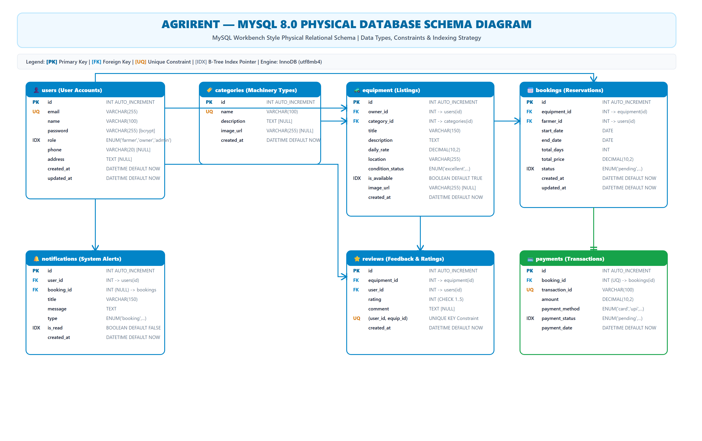

# AgriRent - MySQL 8.0 Database Physical Schema Diagram & Specification

**Project Name:** AgriRent – Agricultural Equipment Rental Marketplace  
**Document Version:** 1.0.0  
**Document Status:** Approved  
**Author:** Database Architect & DevOps Engineering Team  
**Target Location:** `docs/diagrams/05_database_schema_diagram.md`  
**Diagram Assets:**  
- Editable Draw.io Source: [`docs/diagrams/database-schema.drawio`](file:///c:/Users/sanja/OneDrive/Desktop/AgriRent/docs/diagrams/database-schema.drawio)  
- High-Resolution Vector SVG: [`docs/diagrams/database-schema.svg`](file:///c:/Users/sanja/OneDrive/Desktop/AgriRent/docs/diagrams/database-schema.svg)  
- High-Resolution Image PNG: [`docs/diagrams/database-schema.png`](file:///c:/Users/sanja/OneDrive/Desktop/AgriRent/docs/diagrams/database-schema.png)  

---

## 1. Purpose

This document provides the definitive **Physical Database Schema Specification** for the **AgriRent** marketplace built on **MySQL 8.0 Community Edition**. It documents physical storage representations, column data types, memory alignment constraints, index optimization strategies, foreign key constraints, and 3rd Normal Form (3NF) compliance for all 7 relational tables.

---

## 2. Database Overview

* **Database Engine:** MySQL 8.0+
* **Storage Engine:** InnoDB (Supports ACID transactions, row-level locking, foreign key integrity)
* **Default Character Set:** `utf8mb4`
* **Default Collation:** `utf8mb4_unicode_ci` (Full Unicode & Emoji support for equipment titles and descriptions)
* **Connection Management:** Connection Pooling via `mysql2/promise` with configurable pool limit (default 10).

```
+-------------------------------------------------------------------------------+
|                      AGRIRENT PHYSICAL SCHEMA LAYOUT                          |
|                                                                               |
|                                    |
+-------------------------------------------------------------------------------+
```

---

## 3. Table Descriptions & Physical Specs

### 3.1 Table: `users`
Stores user profile accounts, bcrypt hashed credentials, and role authorizations.

```sql
CREATE TABLE users (
  id INT AUTO_INCREMENT PRIMARY KEY,
  name VARCHAR(100) NOT NULL,
  email VARCHAR(255) NOT NULL UNIQUE,
  password VARCHAR(255) NOT NULL,
  role ENUM('farmer', 'owner', 'admin') NOT NULL DEFAULT 'farmer',
  phone VARCHAR(20) DEFAULT NULL,
  address TEXT DEFAULT NULL,
  created_at DATETIME NOT NULL DEFAULT CURRENT_TIMESTAMP,
  updated_at DATETIME NOT NULL DEFAULT CURRENT_TIMESTAMP ON UPDATE CURRENT_TIMESTAMP,
  INDEX idx_users_role (role)
) ENGINE=InnoDB DEFAULT CHARSET=utf8mb4 COLLATE=utf8mb4_unicode_ci;
```

---

### 3.2 Table: `categories`
Stores agricultural machinery categories for catalogue browsing.

```sql
CREATE TABLE categories (
  id INT AUTO_INCREMENT PRIMARY KEY,
  name VARCHAR(100) NOT NULL UNIQUE,
  description TEXT DEFAULT NULL,
  image_url VARCHAR(255) DEFAULT NULL,
  created_at DATETIME NOT NULL DEFAULT CURRENT_TIMESTAMP
) ENGINE=InnoDB DEFAULT CHARSET=utf8mb4 COLLATE=utf8mb4_unicode_ci;
```

---

### 3.3 Table: `equipment`
Stores machinery rental listings posted by Equipment Owners.

```sql
CREATE TABLE equipment (
  id INT AUTO_INCREMENT PRIMARY KEY,
  owner_id INT NOT NULL,
  category_id INT NOT NULL,
  title VARCHAR(150) NOT NULL,
  description TEXT NOT NULL,
  daily_rate DECIMAL(10, 2) NOT NULL CHECK (daily_rate >= 0.00),
  location VARCHAR(255) NOT NULL,
  condition_status ENUM('excellent', 'good', 'fair') NOT NULL DEFAULT 'good',
  is_available BOOLEAN NOT NULL DEFAULT TRUE,
  image_url VARCHAR(255) DEFAULT NULL,
  created_at DATETIME NOT NULL DEFAULT CURRENT_TIMESTAMP,
  updated_at DATETIME NOT NULL DEFAULT CURRENT_TIMESTAMP ON UPDATE CURRENT_TIMESTAMP,
  CONSTRAINT fk_equip_owner FOREIGN KEY (owner_id) REFERENCES users(id) ON DELETE CASCADE,
  CONSTRAINT fk_equip_category FOREIGN KEY (category_id) REFERENCES categories(id) ON DELETE RESTRICT,
  INDEX idx_equip_owner (owner_id),
  INDEX idx_equip_category (category_id),
  INDEX idx_equip_available (is_available)
) ENGINE=InnoDB DEFAULT CHARSET=utf8mb4 COLLATE=utf8mb4_unicode_ci;
```

---

### 3.4 Table: `bookings`
Manages rental reservations made by Farmers.

```sql
CREATE TABLE bookings (
  id INT AUTO_INCREMENT PRIMARY KEY,
  equipment_id INT NOT NULL,
  farmer_id INT NOT NULL,
  start_date DATE NOT NULL,
  end_date DATE NOT NULL,
  total_days INT NOT NULL CHECK (total_days > 0),
  total_price DECIMAL(10, 2) NOT NULL,
  status ENUM('pending', 'approved', 'rejected', 'cancelled', 'completed') NOT NULL DEFAULT 'pending',
  created_at DATETIME NOT NULL DEFAULT CURRENT_TIMESTAMP,
  updated_at DATETIME NOT NULL DEFAULT CURRENT_TIMESTAMP ON UPDATE CURRENT_TIMESTAMP,
  CONSTRAINT fk_booking_equipment FOREIGN KEY (equipment_id) REFERENCES equipment(id) ON DELETE CASCADE,
  CONSTRAINT fk_booking_farmer FOREIGN KEY (farmer_id) REFERENCES users(id) ON DELETE CASCADE,
  INDEX idx_booking_equip (equipment_id),
  INDEX idx_booking_farmer (farmer_id),
  INDEX idx_booking_status (status)
) ENGINE=InnoDB DEFAULT CHARSET=utf8mb4 COLLATE=utf8mb4_unicode_ci;
```

---

### 3.5 Table: `payments`
Logs escrow transactions for approved bookings.

```sql
CREATE TABLE payments (
  id INT AUTO_INCREMENT PRIMARY KEY,
  booking_id INT NOT NULL UNIQUE,
  transaction_id VARCHAR(100) NOT NULL UNIQUE,
  amount DECIMAL(10, 2) NOT NULL CHECK (amount >= 0.00),
  payment_method ENUM('card', 'upi', 'netbanking', 'cash') NOT NULL DEFAULT 'card',
  payment_status ENUM('pending', 'completed', 'failed', 'refunded') NOT NULL DEFAULT 'pending',
  payment_date DATETIME NOT NULL DEFAULT CURRENT_TIMESTAMP,
  CONSTRAINT fk_payment_booking FOREIGN KEY (booking_id) REFERENCES bookings(id) ON DELETE CASCADE,
  INDEX idx_payment_status (payment_status)
) ENGINE=InnoDB DEFAULT CHARSET=utf8mb4 COLLATE=utf8mb4_unicode_ci;
```

---

### 3.6 Table: `notifications`
Stores system and booking alert messages.

```sql
CREATE TABLE notifications (
  id INT AUTO_INCREMENT PRIMARY KEY,
  user_id INT NOT NULL,
  booking_id INT DEFAULT NULL,
  title VARCHAR(150) NOT NULL,
  message TEXT NOT NULL,
  type ENUM('booking_request', 'booking_status', 'payment_alert', 'system') NOT NULL DEFAULT 'system',
  is_read BOOLEAN NOT NULL DEFAULT FALSE,
  created_at DATETIME NOT NULL DEFAULT CURRENT_TIMESTAMP,
  CONSTRAINT fk_notif_user FOREIGN KEY (user_id) REFERENCES users(id) ON DELETE CASCADE,
  CONSTRAINT fk_notif_booking FOREIGN KEY (booking_id) REFERENCES bookings(id) ON DELETE SET NULL,
  INDEX idx_notif_user (user_id),
  INDEX idx_notif_read (is_read)
) ENGINE=InnoDB DEFAULT CHARSET=utf8mb4 COLLATE=utf8mb4_unicode_ci;
```

---

### 3.7 Table: `reviews`
Holds post-rental ratings and user commentary.

```sql
CREATE TABLE reviews (
  id INT AUTO_INCREMENT PRIMARY KEY,
  equipment_id INT NOT NULL,
  user_id INT NOT NULL,
  rating INT NOT NULL CHECK (rating BETWEEN 1 AND 5),
  comment TEXT DEFAULT NULL,
  created_at DATETIME NOT NULL DEFAULT CURRENT_TIMESTAMP,
  CONSTRAINT fk_review_equipment FOREIGN KEY (equipment_id) REFERENCES equipment(id) ON DELETE CASCADE,
  CONSTRAINT fk_review_user FOREIGN KEY (user_id) REFERENCES users(id) ON DELETE CASCADE,
  CONSTRAINT uq_user_equipment_review UNIQUE (user_id, equipment_id),
  INDEX idx_review_equip (equipment_id),
  INDEX idx_review_user (user_id)
) ENGINE=InnoDB DEFAULT CHARSET=utf8mb4 COLLATE=utf8mb4_unicode_ci;
```

---

## 4. Foreign Key Relationships Summary

| Source Table | Source Column | Target Table | Target Column | On Delete Action | On Update Action |
|---|---|---|---|---|---|
| `equipment` | `owner_id` | `users` | `id` | CASCADE | CASCADE |
| `equipment` | `category_id` | `categories` | `id` | RESTRICT | CASCADE |
| `bookings` | `equipment_id` | `equipment` | `id` | CASCADE | CASCADE |
| `bookings` | `farmer_id` | `users` | `id` | CASCADE | CASCADE |
| `payments` | `booking_id` | `bookings` | `id` | CASCADE | CASCADE |
| `notifications` | `user_id` | `users` | `id` | CASCADE | CASCADE |
| `notifications` | `booking_id` | `bookings` | `id` | SET NULL | CASCADE |
| `reviews` | `equipment_id` | `equipment` | `id` | CASCADE | CASCADE |
| `reviews` | `user_id` | `users` | `id` | CASCADE | CASCADE |

---

## 5. Constraints & Business Logic Enforcement

1. **Check Constraints:**
   - `equipment.daily_rate >= 0.00`
   - `bookings.total_days > 0`
   - `payments.amount >= 0.00`
   - `reviews.rating BETWEEN 1 AND 5`
2. **Unique Constraints:**
   - `users.email` (Ensures unique login credentials)
   - `categories.name` (Prevents duplicate equipment category titles)
   - `payments.booking_id` (Enforces 1:1 relationship between booking and payment)
   - `payments.transaction_id` (Prevents duplicate transaction processing)
   - `reviews(user_id, equipment_id)` (Restricts a farmer to 1 review per equipment)

---

## 6. Indexing Strategy & Performance Tuning

To maintain sub-50ms query execution speed under heavy read/write traffic:
* **Primary Key B-Tree Indexes:** Automatically assigned on `id` columns for all 7 tables.
* **Foreign Key Lookups:** B-Tree indexes created on all FK columns (`owner_id`, `category_id`, `equipment_id`, `farmer_id`, `booking_id`, `user_id`) to accelerate `JOIN` queries.
* **Filter Optimization Indexes:**
  - `idx_equip_available` on `equipment(is_available)` speeds up catalog searching for active listings.
  - `idx_booking_status` on `bookings(status)` accelerates dashboard filtering for pending/approved requests.
  - `idx_notif_read` on `notifications(is_read)` optimizes unread badge count queries.

---

## 7. Normalization Analysis (1NF, 2NF, 3NF)

* **First Normal Form (1NF):** Every table attribute holds atomic scalar values (no array strings or multi-valued columns). All tables possess a primary key.
* **Second Normal Form (2NF):** All non-key fields depend entirely on the whole primary key (`id`), eliminating partial functional dependencies.
* **Third Normal Form (3NF):** No transitive functional dependencies exist. Non-key columns (e.g., `daily_rate`, `location`) depend exclusively on the candidate key (`id`). Derived attributes like `total_price` in `bookings` are computed explicitly during date range validation.

---

## 8. Assumptions

1. Single base currency (INR / USD) used for daily rental rates and transaction settlements.
2. User account deletion (`ON DELETE CASCADE`) automatically purges associated equipment listings, notifications, and reviews.
3. Equipment removal cascades to delete pending booking records and reviews.

---

## 9. Future Database Extensions

1. **Spatial Indexing (`POINT` Datatype):** Adding a `coordinates POINT SRID 4326` field to `equipment` for MySQL Spatial GIS distance queries (`ST_Distance_Sphere`).
2. **Full-Text Search Index (`FULLTEXT`):** Adding a FULLTEXT index on `equipment(title, description)` for natural language search queries.

---

## 10. Document Revision History

| Version | Date | Description | Author | Approved By |
|---|---|---|---|---|
| v1.0.0 | 2026-08-06 | Initial Enterprise Database Schema Release | Lead DB Architect | Solution Architect |
