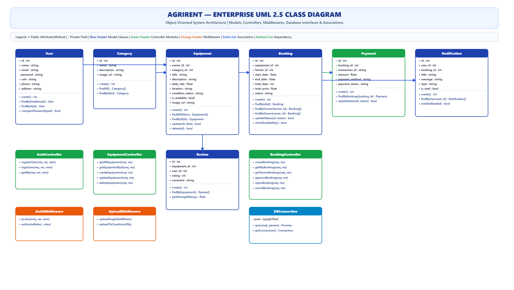
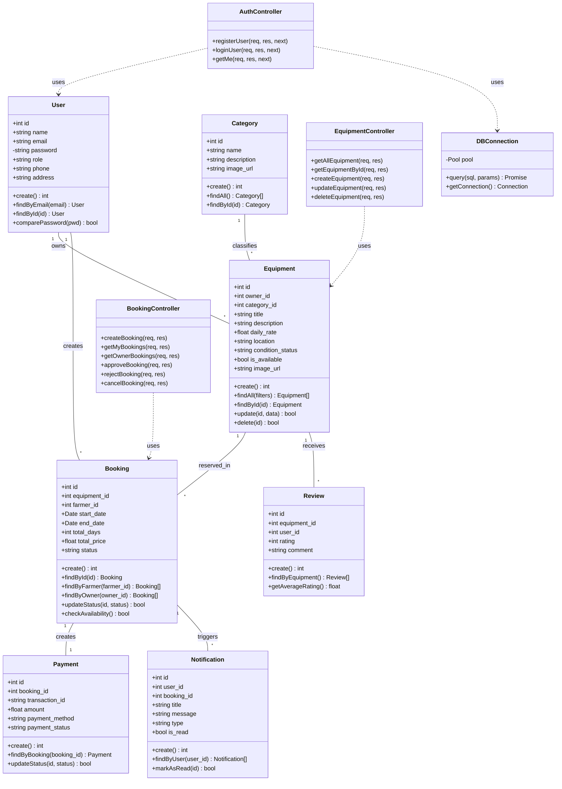

# AgriRent - Enterprise UML 2.5 Class Diagram Specification

**Project Name:** AgriRent – Agricultural Equipment Rental Marketplace  
**Document Version:** 1.0.0  
**Document Status:** Approved  
**Author:** Principal Software Architect & Lead Object-Oriented Designer  
**Target Location:** `docs/diagrams/06_uml_class_diagram.md`  
**Diagram Assets:**  
- Editable Draw.io Source: [`docs/diagrams/uml-class-diagram.drawio`](file:///c:/Users/sanja/OneDrive/Desktop/AgriRent/docs/diagrams/uml-class-diagram.drawio)  
- High-Resolution Vector SVG: [`docs/diagrams/uml-class-diagram.svg`](file:///c:/Users/sanja/OneDrive/Desktop/AgriRent/docs/diagrams/uml-class-diagram.svg)  
- High-Resolution Image PNG: [`docs/diagrams/uml-class-diagram.png`](file:///c:/Users/sanja/OneDrive/Desktop/AgriRent/docs/diagrams/uml-class-diagram.png)  

---

## 1. Purpose

This document provides the complete **UML 2.5 Class Diagram Specification** for the **AgriRent** application. Following the **Model-View-Controller (MVC)** architectural design pattern, this specification documents the structural organization, class attributes, method signatures, visibility scopes (`+` public, `-` private), and associations between model abstractions, API controllers, middleware guards, and database access utilities.

---

## 2. Structural UML Class Diagram Visualizations

### 2.1 High-Resolution Class Diagram View (SVG / PNG)

### 2.2 Mermaid Class Diagram Definition

---

## 3. Detailed Class Catalog & Method Signatures

### 3.1 Domain Model Classes

#### `User` (`server/models/User.js`)
* **Attributes:**
  - `+ id`: `int` (Primary Key)
  - `+ name`: `string`
  - `+ email`: `string` (Unique)
  - `- password`: `string` (Bcrypt hash)
  - `+ role`: `string` (`'farmer'`, `'owner'`, `'admin'`)
  - `+ phone`: `string`
  - `+ address`: `string`
* **Methods:**
  - `+ create(userData: object): Promise<int>`: Inserts user into database and returns generated ID.
  - `+ findByEmail(email: string): Promise<User|null>`: Queries user record by email.
  - `+ findById(id: int): Promise<User|null>`: Queries user record by primary key.
  - `+ comparePassword(candidatePassword: string): Promise<boolean>`: Executes `bcrypt.compare`.

#### `Equipment` (`server/models/Equipment.js`)
* **Attributes:**
  - `+ id`: `int`
  - `+ owner_id`: `int` (Foreign Key -> `User.id`)
  - `+ category_id`: `int` (Foreign Key -> `Category.id`)
  - `+ title`: `string`
  - `+ description`: `string`
  - `+ daily_rate`: `float`
  - `+ location`: `string`
  - `+ condition_status`: `string`
  - `+ is_available`: `boolean`
  - `+ image_url`: `string`
* **Methods:**
  - `+ create(data: object): Promise<int>`
  - `+ findAll(filters: object): Promise<Equipment[]>`
  - `+ findById(id: int): Promise<Equipment|null>`
  - `+ update(id: int, data: object): Promise<boolean>`
  - `+ delete(id: int): Promise<boolean>`

#### `Booking` (`server/models/Booking.js`)
* **Attributes:**
  - `+ id`: `int`
  - `+ equipment_id`: `int`
  - `+ farmer_id`: `int`
  - `+ start_date`: `Date`
  - `+ end_date`: `Date`
  - `+ total_days`: `int`
  - `+ total_price`: `float`
  - `+ status`: `string` (`'pending'`, `'approved'`, `'rejected'`, `'cancelled'`, `'completed'`)
* **Methods:**
  - `+ create(bookingData: object): Promise<int>`
  - `+ findById(id: int): Promise<Booking|null>`
  - `+ findByFarmer(farmer_id: int): Promise<Booking[]>`
  - `+ findByOwner(owner_id: int): Promise<Booking[]>`
  - `+ updateStatus(id: int, status: string): Promise<boolean>`
  - `+ checkAvailability(equipment_id: int, start: Date, end: Date): Promise<boolean>`

---

### 3.2 Controller Modules

#### `AuthController` (`server/controllers/authController.js`)
* **Methods:**
  - `+ registerUser(req: Request, res: Response, next: NextFunction): Promise<void>`
  - `+ loginUser(req: Request, res: Response, next: NextFunction): Promise<void>`
  - `+ getMe(req: Request, res: Response, next: NextFunction): Promise<void>`

#### `EquipmentController` (`server/controllers/equipmentController.js`)
* **Methods:**
  - `+ getAllEquipment(req: Request, res: Response): Promise<void>`
  - `+ getEquipmentById(req: Request, res: Response): Promise<void>`
  - `+ createEquipment(req: Request, res: Response): Promise<void>`
  - `+ updateEquipment(req: Request, res: Response): Promise<void>`
  - `+ deleteEquipment(req: Request, res: Response): Promise<void>`

#### `BookingController` (`server/controllers/bookingController.js`)
* **Methods:**
  - `+ createBooking(req: Request, res: Response): Promise<void>`
  - `+ getMyBookings(req: Request, res: Response): Promise<void>`
  - `+ getOwnerBookings(req: Request, res: Response): Promise<void>`
  - `+ approveBooking(req: Request, res: Response): Promise<void>`
  - `+ rejectBooking(req: Request, res: Response): Promise<void>`
  - `+ cancelBooking(req: Request, res: Response): Promise<void>`

---

## 4. Class Relationship Specifications

| Source Class | Target Class | Relationship Type | Multiplicity | Description |
|---|---|---|---|---|
| `User` | `Equipment` | **Association** | 1 to 0..* | One Owner user owns zero or more Equipment listings. |
| `Category` | `Equipment` | **Association** | 1 to 0..* | One Category classifies zero or more Equipment items. |
| `User` | `Booking` | **Association** | 1 to 0..* | One Farmer user creates zero or more Bookings. |
| `Equipment` | `Booking` | **Association** | 1 to 0..* | One Equipment item is reserved in zero or more Bookings. |
| `Booking` | `Payment` | **Association** | 1 to 1 | One Booking creates exactly one Payment record. |
| `Booking` | `Notification` | **Association** | 1 to 0..* | One Booking triggers zero or more Notifications. |
| `Equipment` | `Review` | **Association** | 1 to 0..* | One Equipment receives zero or more Reviews. |
| `Controllers` | `Models` | **Dependency** | Client-Supplier | Controllers invoke static methods on Model classes (`..>`). |
| `Models` | `DBConnection` | **Dependency** | Client-Supplier | Models execute queries via `DBConnection` connection pool. |

---

## 5. Architectural Design Decisions

1. **Active Record vs. Data Mapper Pattern:** Domain model classes (`User.js`, `Equipment.js`, `Booking.js`) encapsulate SQL query methods, providing lightweight object abstraction without ORM overhead.
2. **Encapsulation of Sensitive State:** Password fields (`- password`) marked private and omitted from standard API JSON serialized responses.
3. **Stateless Middleware Composition:** `AuthMiddleware` verifies JWT signature independently per request without keeping active state in memory.

---

## 6. Document Revision History

| Version | Date | Description | Author | Approved By |
|---|---|---|---|---|
| v1.0.0 | 2026-08-06 | Initial Enterprise UML 2.5 Class Diagram Specification | Principal Architect | Solution Architect |
