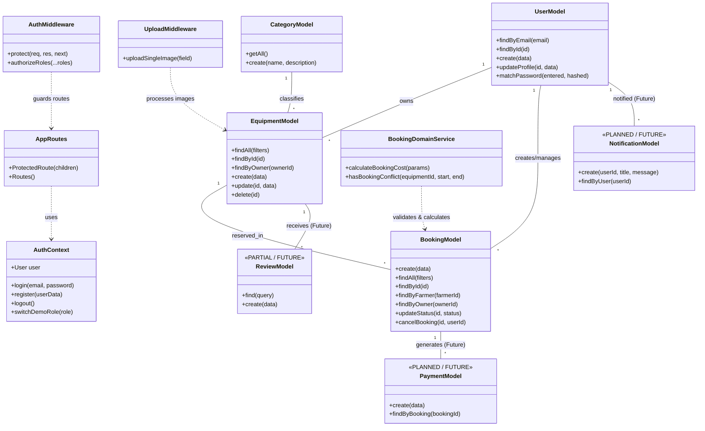

# AGRIRENT: UML CLASS DIAGRAM SPECIFICATION
**Project Title:** Agricultural Equipment Rental Marketplace  
**Capstone Stage:** Capstone Review-I (Day 11)  
**Target File Path:** `docs/diagrams/06_uml_class_diagram.md`  

---

## 1. OFFICIAL MERMAID CLASS DIAGRAM

---

## 2. ACTIVE VS FUTURE CLASS CATALOG

### Active Core Classes (Review-I Verified)
1. **`UserModel`** (`server/models/User.js`): Database methods for authentication, profile updates, and RBAC user queries.
2. **`EquipmentModel`** (`server/models/Equipment.js`): Machinery listing CRUD operations, catalog search filters, and JSON image handling.
3. **`BookingModel`** (`server/models/Booking.js`): Reservation lifecycle management, status transitions, and duration calculations.
4. **`CategoryModel`** (`server/models/Category.js`): Machine category lookups and initialization.
5. **`AuthMiddleware`** (`server/middleware/authMiddleware.js`): `protect` JWT token verification and `authorizeRoles` access control.
6. **`UploadMiddleware`** (`server/middleware/uploadMiddleware.js`): Multer image file upload handler.
7. **`BookingDomainService`** (`server/services/bookingService.js`): Overlap scheduling validation (`hasBookingConflict`) and pricing calculation (`calculateBookingCost`).

### Planned / Future Classes (Labeled as Future)
8. **`PaymentModel`** (`server/models/Payment.js` - *PLANNED / FUTURE*)
9. **`ReviewModel`** (`server/models/Review.js` - *PARTIAL / FUTURE*)
10. **`NotificationModel`** (`server/models/Notification.js` - *PLANNED / FUTURE*)
