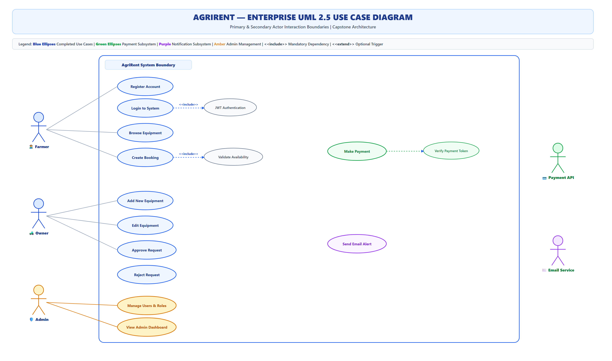
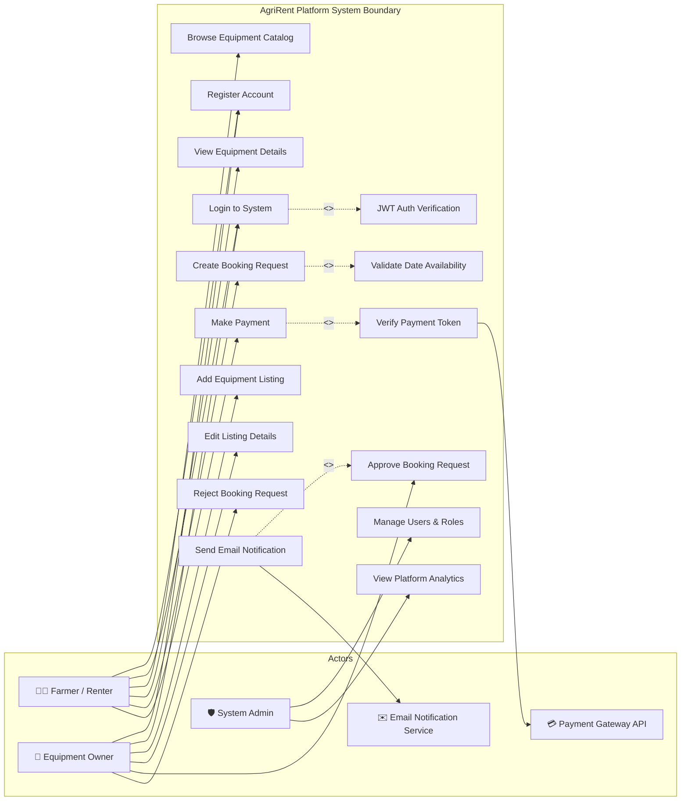

# AgriRent - Enterprise Use Case Diagram & Technical Specification

**Project Name:** AgriRent – Agricultural Equipment Rental Marketplace  
**Document Version:** 1.0.0  
**Document Status:** Approved  
**Author:** Requirements Lead & Systems Analyst  
**Target Location:** `docs/diagrams/07_use_case_diagram.md`  
**Diagram Assets:**  
- Editable Draw.io Source: [`docs/diagrams/use-case-diagram.drawio`](file:///c:/Users/sanja/OneDrive/Desktop/AgriRent/docs/diagrams/use-case-diagram.drawio)  
- High-Resolution Vector SVG: [`docs/diagrams/use-case-diagram.svg`](file:///c:/Users/sanja/OneDrive/Desktop/AgriRent/docs/diagrams/use-case-diagram.svg)  
- High-Resolution Image PNG: [`docs/diagrams/use-case-diagram.png`](file:///c:/Users/sanja/OneDrive/Desktop/AgriRent/docs/diagrams/use-case-diagram.png)  

---

## 1. Purpose

The purpose of this **UML 2.5 Use Case Diagram Specification** is to define the functional scope, user interaction perimeters, actor capabilities, and stereotype relationships (`<<include>>`, `<<extend>>`) for the **AgriRent** marketplace platform.

This specification serves as the formal boundary agreement between domain stakeholders, end users (Farmers, Equipment Owners, Admins), and backend development teams.

---

## 2. Enterprise Use Case Visualizations

### 2.1 High-Resolution Use Case View (SVG / PNG)

### 2.2 Mermaid Use Case Definition

---

## 3. Actor Profiles & Roles

| Actor Name | Type | Description / Responsibilities |
|---|---|---|
| **Farmer / Renter** | Primary Human Actor | Registers on AgriRent, browses equipment categories, checks date availability, creates booking requests, and processes rental payments. |
| **Equipment Owner** | Primary Human Actor | Publishes equipment listings with daily rental pricing, manages availability schedules, approves or rejects farmer booking requests. |
| **System Admin** | Primary Human Actor | Oversees marketplace operations, resolves disputes, manages user accounts, verifies equipment listings, views platform analytics. |
| **Payment Gateway API** | Secondary System Actor | External integration (Razorpay / Stripe) processing card/UPI payment transactions and returning webhook status verification tokens. |
| **Email Notification Service** | Secondary System Actor | External SMTP service (SendGrid / Nodemailer) executing email dispatches for booking creation, approval alerts, and payment receipts. |

---

## 4. Use Case Catalog & Module Categorization

### 4.1 Authentication Subsystem
* **Register Account:** User specifies role (`farmer`, `owner`), profile credentials, and address.
* **Login to System:** Validates user email/password pair against bcrypt hashes.
* **JWT Auth Verification (`<<include>>`):** Automatically invoked during login to generate stateless Bearer JWT token.

### 4.2 Equipment Management Subsystem
* **Add Equipment Listing:** Owner submits listing metadata (title, category, rate, location) and uploads image via Multer/Cloudinary.
* **Edit Listing Details:** Owner updates daily rate, location, condition status, or availability boolean toggle.
* **Browse Equipment Catalog:** Farmers query equipment filtered by category, location keyword, and availability.

### 4.3 Booking Management Subsystem
* **Create Booking Request:** Farmer selects start/end dates for target equipment.
* **Validate Date Availability (`<<include>>`):** Automatically checks SQL database to prevent double-booking collisions.
* **Approve / Reject Booking Request:** Owner reviews incoming booking requests and updates status (`approved` / `rejected`).

### 4.4 Payment & Notification Subsystems (Upcoming)
* **Make Payment:** Farmer submits payment via online gateway checkout.
* **Verify Payment Token (`<<include>>`):** Gatekeeper verification with external Payment Gateway API.
* **Send Email Notification (`<<extend>>`):** Optionally triggered upon booking approval or payment completion to dispatch email alerts.

### 4.5 Admin Governance Subsystem
* **Manage Users & Roles:** Admin updates user permissions, bans fraudulent accounts, or resets access.
* **View Platform Analytics:** Provides high-level metrics on total active listings, gross booking value, and user registration counts.

---

## 5. Stereotype Relationships (`<<include>>` & `<<extend>>`)

1. `Login to System` **`<<include>>`** `JWT Auth Verification`: Executing a login mandatory step requires generating a signed JWT token string.
2. `Create Booking Request` **`<<include>>`** `Validate Date Availability`: A booking cannot be submitted without validating date range overlap against existing DB records.
3. `Make Payment` **`<<include>>`** `Verify Payment Token`: Payment processing mandates third-party token validation before transitioning status to `completed`.
4. `Send Email Notification` **`<<extend>>`** `Approve Booking Request`: Booking approval conditionally extends execution to trigger async email dispatches to the farmer.

---

## 6. Document Revision History

| Version | Date | Description | Author | Approved By |
|---|---|---|---|---|
| v1.0.0 | 2026-08-06 | Enterprise Use Case Diagram Release | Requirements Lead | Systems Architect |
