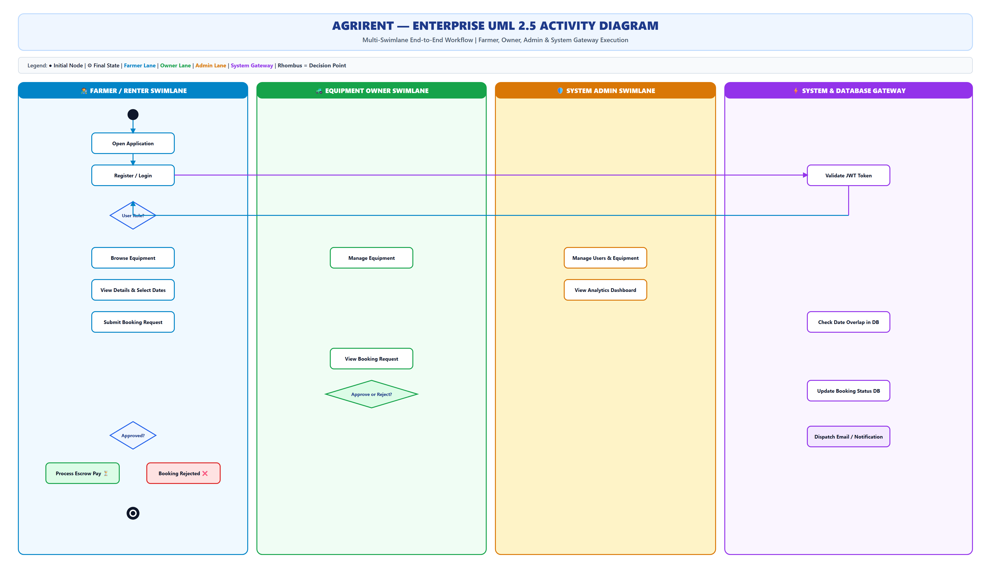
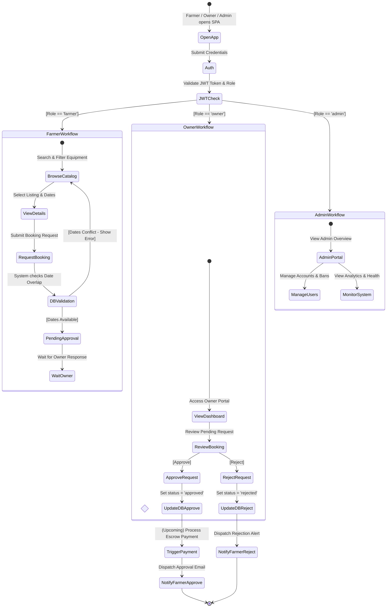

# AgriRent - Enterprise UML 2.5 Activity Diagram Specification

**Project Name:** AgriRent – Agricultural Equipment Rental Marketplace  
**Document Version:** 1.0.0  
**Document Status:** Approved  
**Author:** Lead Business Analyst & Enterprise Systems Architect  
**Target Location:** `docs/diagrams/08_activity_diagram.md`  
**Diagram Assets:**  
- Editable Draw.io Source: [`docs/diagrams/activity-diagram.drawio`](file:///c:/Users/sanja/OneDrive/Desktop/AgriRent/docs/diagrams/activity-diagram.drawio)  
- High-Resolution Vector SVG: [`docs/diagrams/activity-diagram.svg`](file:///c:/Users/sanja/OneDrive/Desktop/AgriRent/docs/diagrams/activity-diagram.svg)  
- High-Resolution Image PNG: [`docs/diagrams/activity-diagram.png`](file:///c:/Users/sanja/OneDrive/Desktop/AgriRent/docs/diagrams/activity-diagram.png)  

---

## 1. Purpose

The purpose of this **UML 2.5 Activity Diagram Specification** is to document the dynamic operational workflows, branching decision logic, concurrent processes, and swimlane role divisions across the **AgriRent** application.

It details how Farmers, Equipment Owners, System Administrators, and the Express/MySQL backend interact step-by-step from initial user login to booking approval, payment escrow, and alert notification dispatch.

---

## 2. Multi-Swimlane Activity Diagram Visualizations

### 2.1 High-Resolution Activity View (SVG / PNG)

### 2.2 Mermaid Activity Flow Definition

---

## 3. Swimlane Descriptions & Functional Breakdown

### 3.1 Farmer / Renter Swimlane (`👨‍🌾`)
* **Initial Action:** Launches client application, registers or authenticates with email/password.
* **Core Activities:** 
  - Searches catalog by machinery category, location, and rate filters.
  - Inspects equipment specifications and selects desired rental date range (`start_date`, `end_date`).
  - Submits booking reservation request.
  - Receives booking status update (Approved / Rejected).
  - *(Upcoming)* Proceeds to online escrow payment checkout upon owner approval.

### 3.2 Equipment Owner Swimlane (`🚜`)
* **Core Activities:**
  - Publishes new machinery listings (title, daily rate, location, Cloudinary image upload).
  - Accesses Owner Dashboard to view incoming rental requests.
  - Reviews rental date range and farmer profile ratings.
  - Executes decision action: **Approve** or **Reject** booking request.

### 3.3 System Admin Swimlane (`🛡️`)
* **Core Activities:**
  - Audits user registrations and enforces RBAC policy permissions.
  - Verifies equipment listing authenticity and removes fraudulent posts.
  - Monitors application health indicators via `/api/health`.

### 3.4 System & Database Gateway Swimlane (`⚡`)
* **Automated Backend Execution:**
  - **JWT Middleware:** Verifies token signatures (`JWT_SECRET`) and extracts role payload.
  - **Booking Validation Engine:** Executes SQL query checking overlapping dates (`start_date <= existing_end AND end_date >= existing_start`).
  - **State Machine Update:** Performs atomic SQL updates on `bookings.status`.
  - **Notification Service:** Triggers in-app alerts and dispatches email notifications via Nodemailer SMTP.

---

## 4. Key Decision Points & Guard Conditions

| Decision Point | Guard Condition | Output Action Path |
|---|---|---|
| **User Role Routing** | `[Role == 'farmer']` | Navigate to Equipment Catalog & Booking Workflow. |
| | `[Role == 'owner']` | Navigate to Owner Listing & Approval Dashboard. |
| | `[Role == 'admin']` | Navigate to System Governance Portal. |
| **Date Availability Check** | `[Date Overlap == True]` | Abort request, return HTTP 400 Bad Request ("Equipment unavailable"). |
| | `[Date Overlap == False]` | Write booking record with `status = 'pending'`. |
| **Owner Booking Action** | `[Owner Action == Approve]` | Set `status = 'approved'`, trigger payment & notification flow. |
| | `[Owner Action == Reject]` | Set `status = 'rejected'`, release date hold, notify farmer. |

---

## 5. Document Revision History

| Version | Date | Description | Author | Approved By |
|---|---|---|---|---|
| v1.0.0 | 2026-08-06 | Enterprise UML 2.5 Activity Diagram Specification | Business Analyst | Solution Architect |
