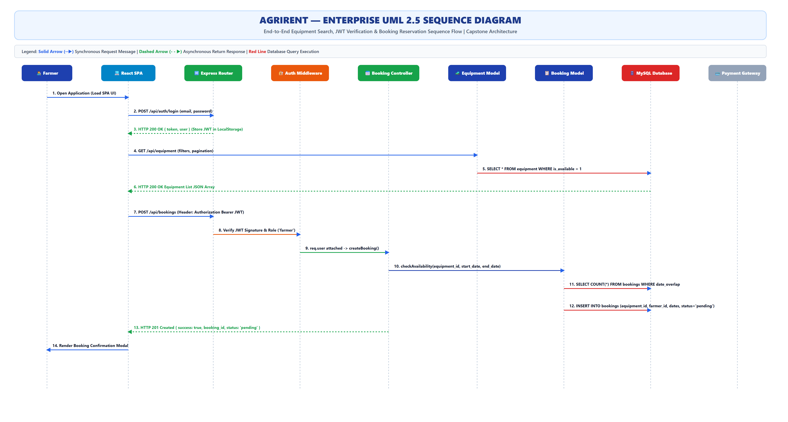
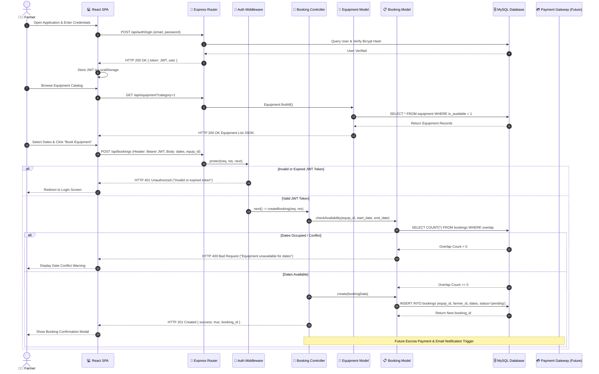

# AgriRent - Enterprise UML 2.5 Sequence Diagram Specification

**Project Name:** AgriRent – Agricultural Equipment Rental Marketplace  
**Document Version:** 1.0.0  
**Document Status:** Approved  
**Author:** Lead Backend Architect & Systems Design Specialist  
**Target Location:** `docs/diagrams/09_sequence_diagram.md`  
**Diagram Assets:**  
- Editable Draw.io Source: [`docs/diagrams/sequence-diagram.drawio`](file:///c:/Users/sanja/OneDrive/Desktop/AgriRent/docs/diagrams/sequence-diagram.drawio)  
- High-Resolution Vector SVG: [`docs/diagrams/sequence-diagram.svg`](file:///c:/Users/sanja/OneDrive/Desktop/AgriRent/docs/diagrams/sequence-diagram.svg)  
- High-Resolution Image PNG: [`docs/diagrams/sequence-diagram.png`](file:///c:/Users/sanja/OneDrive/Desktop/AgriRent/docs/diagrams/sequence-diagram.png)  

---

## 1. Purpose

The purpose of this **UML 2.5 Sequence Diagram Specification** is to document the chronological order of message exchanges, method invocations, authorization checks, and database queries executed during the **Equipment Search & Booking Reservation Lifecycle** in **AgriRent**.

It visually outlines the exact synchronous and asynchronous interactions between the Farmer (Actor), React SPA Client, Express Gateway Router, Auth Middleware, Controllers, Models, and MySQL Database.

---

## 2. Enterprise Sequence Diagram Visualizations

### 2.1 High-Resolution Sequence View (SVG / PNG)

### 2.2 Mermaid Sequence Flow Definition

---

## 3. Participants & Lifelines Matrix

| Participant | Type / Layer | Role & Responsibility |
|---|---|---|
| **Farmer** | Primary Human Actor | Initiates authentication, browse requests, and booking reservations. |
| **React SPA** | Presentation (Client) | Captures form input, injects Bearer token header, handles HTTP response UI state. |
| **Express Router** | Gateway / Control | Matches API route endpoints (`/api/auth`, `/api/equipment`, `/api/bookings`). |
| **Auth Middleware** | Security Tier | Decodes JWT payload, validates signature (`JWT_SECRET`), checks role authorization. |
| **Booking Controller** | Application Business Logic | Calculates rental duration, total pricing, coordinates availability checking & creation. |
| **Equipment Model** | Data Access Layer | Executes SQL SELECT queries for machinery listings. |
| **Booking Model** | Data Access Layer | Executes availability validation queries & `INSERT INTO bookings`. |
| **MySQL Database** | Relational Persistence | Enforces foreign keys, table indexes, and ACID transaction writes. |
| **Payment Gateway API** | External Service (Future) | Integrates payment checkout webhooks to confirm escrow fund holds. |

---

## 4. Detailed Sequence Step Descriptions

1. **User Authentication:** Farmer submits credentials via `POST /api/auth/login`. Upon hash match, backend signs JWT token and returns JSON string stored in browser `LocalStorage`.
2. **Catalog Browsing:** React issues `GET /api/equipment`. Controller invokes `Equipment.findAll()`, executing parameterized SQL read on MySQL `equipment` table.
3. **Reservation Initiation:** Farmer selects rental date range (`start_date`, `end_date`) and clicks **Submit Booking**.
4. **Header Interception:** `fetchWithAuth` authentication wrapper injects `Authorization: Bearer <JWT>` header in `POST /api/bookings` request.
5. **JWT Signature Validation:** `protect` middleware executes `jwt.verify(token, JWT_SECRET)`.
6. **Date Overlap Prevention:** `Booking.checkAvailability()` queries database for conflicting reservations where `status IN ('pending', 'approved')`.
7. **Reservation Creation:** If clear, `INSERT INTO bookings` persists record with status `'pending'`, returning `HTTP 201 Created`.

---

## 5. Alternative & Error Handling Scenarios

### 5.1 Scenario A: Invalid / Expired JWT Token
* **Trigger:** Client sends expired token string or missing `Authorization` header.
* **Flow:** `protect` middleware traps `JsonWebTokenError` / `TokenExpiredError`, aborts execution, and outputs `HTTP 401 Unauthorized`.
* **Client Action:** React `fetchWithAuth` response handler redirects user to `/login`.

### 5.2 Scenario B: Date Overlap Conflict
* **Trigger:** Equipment requested is already reserved for overlapping dates.
* **Flow:** `checkAvailability()` returns `false`. Controller returns `HTTP 400 Bad Request` with payload `{ success: false, message: "Equipment is already booked for selected dates" }`.
* **Client Action:** Displays date picker error alert.

---

## 6. Document Revision History

| Version | Date | Description | Author | Approved By |
|---|---|---|---|---|
| v1.0.0 | 2026-08-06 | Enterprise UML 2.5 Sequence Diagram Release | Lead Backend Architect | Solution Architect |
