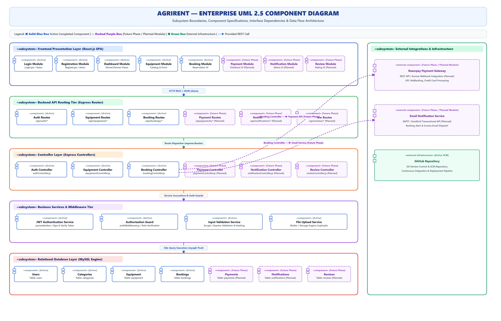

# AgriRent - Enterprise UML 2.5 Component Diagram Specification

**Project Name:** AgriRent – Agricultural Equipment Rental Marketplace  
**Document Version:** 1.0.0  
**Document Status:** Approved  
**Author:** Software Architecture & Systems Engineering Team  
**Target Location:** `docs/diagrams/10_component_diagram.md`  
**Diagram Assets:**  
- Editable Draw.io Source: [`docs/diagrams/component-diagram.drawio`](file:///c:/Users/sanja/OneDrive/Desktop/AgriRent/docs/diagrams/component-diagram.drawio)  
- High-Resolution Vector SVG: [`docs/diagrams/component-diagram.svg`](file:///c:/Users/sanja/OneDrive/Desktop/AgriRent/docs/diagrams/component-diagram.svg)  
- High-Resolution Image PNG: [`docs/diagrams/component-diagram.png`](file:///c:/Users/sanja/OneDrive/Desktop/AgriRent/docs/diagrams/component-diagram.png)  

---

## 1. Purpose

The purpose of this **UML 2.5 Component Diagram Specification** is to define the modular software architecture, subsystem boundaries, component responsibilities, provided/required interfaces, and communication channels for **AgriRent** (Agricultural Equipment Rental Marketplace).

This diagram serves as a foundational reference for:
- **Final Year Capstone Project Architectural Defense**
- **Software Architecture & Technical Design Documentation**
- **GitHub Portfolio & Engineering Showcase**
- **Industry & Technical Placement Interviews**

It illustrates the separation of concerns across the client-side Single Page Application (SPA), backend REST API router, controller handlers, business services, MySQL relational persistence layer, and external integration adapters.

---

## 2. Enterprise Component Diagram Visualizations

### 2.1 High-Resolution Component Architecture (SVG / PNG)



---

### 2.2 PlantUML Component Specification

```plantuml
@startuml AgriRent_Component_Diagram
skinparam componentStyle uml2
skinparam backgroundColor #FFFFFF
skinparam packageStyle rectangle

title AGRIRENT - ENTERPRISE UML 2.5 COMPONENT DIAGRAM

package "Frontend Presentation Layer (React.js SPA)" <<subsystem>> #EFF6FF {
  [Login Module] as LoginFE
  [Registration Module] as RegisterFE
  [Dashboard Module] as DashFE
  [Equipment Module] as EquipFE
  [Booking Module] as BookingFE
  [Payment Module (Future)] as PayFE #FAF5FF
  [Notification Module (Future)] as NotifFE #FAF5FF
  [Review Module (Future)] as RevFE #FAF5FF
}

package "Backend API Routing Tier (Express Router)" <<subsystem>> #DCFCE7 {
  [Auth Routes] as AuthRoutes
  [Equipment Routes] as EquipRoutes
  [Booking Routes] as BookingRoutes
  [Payment Routes (Future)] as PayRoutes #FAF5FF
  [Notification Routes (Future)] as NotifRoutes #FAF5FF
  [Review Routes (Future)] as RevRoutes #FAF5FF
}

package "Controller Layer (Express Controllers)" <<subsystem>> #FFEDD5 {
  [Auth Controller] as AuthCtrl
  [Equipment Controller] as EquipCtrl
  [Booking Controller] as BookingCtrl
  [Payment Controller (Future)] as PayCtrl #FAF5FF
  [Notification Controller (Future)] as NotifCtrl #FAF5FF
  [Review Controller (Future)] as RevCtrl #FAF5FF
}

package "Business Services & Security Tier" <<subsystem>> #F3E8FF {
  [JWT Authentication Service] as JWTService
  [Authorization Guard] as AuthGuard
  [Input Validation Service] as ValidationService
  [File Upload Service (Multer)] as UploadService
}

package "Relational Database Layer (MySQL Engine)" <<subsystem>> #FEE2E2 {
  database "Users" as DB_Users
  database "Categories" as DB_Categories
  database "Equipment" as DB_Equipment
  database "Bookings" as DB_Bookings
  database "Payments (Future)" as DB_Payments #FAF5FF
  database "Notifications (Future)" as DB_Notifications #FAF5FF
  database "Reviews (Future)" as DB_Reviews #FAF5FF
}

package "External Integrations & Infrastructure" <<subsystem>> #ECFDF5 {
  [Razorpay Payment Gateway (Future)] as RazorpayAPI #FAF5FF
  [Email Notification Service (Future)] as EmailService #FAF5FF
  [GitHub Repository] as GitHubRepo #ECFDF5
}

' Relationships & Interface Calls
LoginFE ..> AuthRoutes : HTTP POST /api/auth/login
RegisterFE ..> AuthRoutes : HTTP POST /api/auth/register
EquipFE ..> EquipRoutes : HTTP GET/POST /api/equipment
BookingFE ..> BookingRoutes : HTTP POST /api/bookings

AuthRoutes --> AuthCtrl : Dispatch
EquipRoutes --> EquipCtrl : Dispatch
BookingRoutes --> BookingCtrl : Dispatch

AuthCtrl --> ValidationService : Validate & Hash (bcrypt)
AuthCtrl --> JWTService : Issue JWT Token
EquipCtrl --> UploadService : Save Uploaded Images
BookingCtrl --> AuthGuard : Verify Bearer Token

AuthCtrl --> DB_Users : SQL Query
EquipCtrl --> DB_Equipment : SQL Query
EquipCtrl --> DB_Categories : SQL Query
BookingCtrl --> DB_Bookings : SQL Query

BookingCtrl ..> RazorpayAPI : Escrow Payment API (Future)
BookingCtrl ..> EmailService : SMTP Confirmation (Future)
@enduml
```



---

## 3. Subsystem & Component Catalog

### 3.1 Presentation Layer (`«subsystem» React SPA Client`)

The client tier is implemented as a modern single-page application (SPA) built with **React.js**, **Vite**, and styled with **Tailwind CSS**. It communicates asynchronously with the backend via **Axios**.

| Component Name | Stereotype | File Location | Status | Responsibility |
|---|---|---|---|---|
| **Login Module** | `«component»` | `client/src/pages/Login.jsx` | **Active Component** | Renders user login form, validates credentials client-side, dispatches POST requests, stores JWT token. |
| **Registration Module** | `«component»` | `client/src/pages/Register.jsx` | **Active Component** | Handles farmer & owner signup workflows, role selection, phone validation. |
| **Dashboard Module** | `«component»` | `client/src/pages/Owner/` & `Farmer/` | **Active Component** | Renders role-specific administrative views, active rentals, equipment listings, booking statuses. |
| **Equipment Module** | `«component»` | `client/src/pages/Equipment/` | **Active Component** | Handles equipment catalog browsing, category filtering, search input, equipment registration form. |
| **Booking Module** | `«component»` | `client/src/components/Booking/` | **Active Component** | Manages rental date picker, duration total calculation, booking submission modals. |
| **Payment Module** | `«component»` | `client/src/components/Payment/` | **Future Phase / Planned Module** | Payment gateway checkout integration (UPI, NetBanking, Escrow confirmation). |
| **Notification Module** | `«component»` | `client/src/components/Notifications/` | **Future Phase / Planned Module** | Displays real-time or polling alert badges for booking status updates. |
| **Review Module** | `«component»` | `client/src/components/Reviews/` | **Future Phase / Planned Module** | Star rating and text feedback widget for completed rentals. |

---

### 3.2 Backend API Routing Tier (`«subsystem» Express API Gateway`)

Acts as the entry gateway for incoming HTTP requests, matching endpoints and applying middle-tier security guards.

| Component Name | Endpoint Prefix | Status | Responsibility |
|---|---|---|---|
| **Auth Routes** | `/api/auth` | **Active Component** | Routes `/register`, `/login`, `/profile`, `/me` requests. |
| **Equipment Routes** | `/api/equipment` | **Active Component** | Routes GET catalog, GET `:id`, POST add equipment, PUT update, DELETE listings. |
| **Booking Routes** | `/api/bookings` | **Active Component** | Routes POST create reservation, GET user bookings, PUT status updates (approve/cancel). |
| **Payment Routes** | `/api/payments` | **Future Phase / Planned Module** | Routes payment creation, Razorpay webhooks, refund requests. |
| **Notification Routes** | `/api/notifications` | **Future Phase / Planned Module** | Routes user notification retrieval, mark-as-read updates. |
| **Review Routes** | `/api/reviews` | **Future Phase / Planned Module** | Routes review submissions, rating summaries per equipment. |

---

### 3.3 Application Controllers Layer (`«subsystem» Express Controllers`)

Encapsulates application controller logic, handling HTTP request parameters, response formatting, and service coordination.

| Component Name | Handler File | Status | Main Functions |
|---|---|---|---|
| **Auth Controller** | `server/controllers/authController.js` | **Active Component** | `registerUser()`, `loginUser()`, `getUserProfile()` |
| **Equipment Controller** | `server/controllers/equipmentController.js` | **Active Component** | `getAllEquipment()`, `getEquipmentById()`, `createEquipment()`, `deleteEquipment()` |
| **Booking Controller** | `server/controllers/bookingController.js` | **Active Component** | `createBooking()`, `getUserBookings()`, `updateBookingStatus()` |
| **Payment Controller** | `server/controllers/paymentController.js` | **Future Phase / Planned Module** | `createOrder()`, `verifyPaymentSignature()`, `processRefund()` |
| **Notification Controller** | `server/controllers/notificationController.js` | **Future Phase / Planned Module** | `sendNotification()`, `getUserNotifications()` |
| **Review Controller** | `server/controllers/reviewController.js` | **Future Phase / Planned Module** | `addReview()`, `getEquipmentReviews()` |

---

### 3.4 Business Logic & Security Tier (`«subsystem» Core Services`)

Contains re-usable middleware, utility services, data validators, and security components.

| Component Name | Core Library | Functionality |
|---|---|---|
| **JWT Authentication Service** | `jsonwebtoken` | Generates signed JSON Web Tokens (`jwt.sign`) with role payload; verifies signatures (`jwt.verify`). |
| **Authorization Guard** | `authMiddleware.js` | Express middleware (`protect`) extracting HTTP `Authorization: Bearer <token>` header to enforce access control. |
| **Input Validation Service** | `bcrypt` / Express | Hashes passwords (`bcrypt.hash` with salt 10), compares credentials (`bcrypt.compare`), validates body schemas. |
| **File Upload Service** | `multer` | Disk storage engine configured to inspect MIME types and upload machinery images to `server/uploads/`. |

---

### 3.5 Relational Database Layer (`«subsystem» MySQL Data Tier`)

Relational persistence tier running MySQL database engine accessed via `mysql2` connection pool.

| Component Entity | Table Name | Key Schema Fields |
|---|---|---|
| **Users Entity** | `users` | `id`, `name`, `email`, `password` (hashed), `role` (`farmer`/`owner`/`admin`), `phone`, `created_at` |
| **Categories Entity** | `categories` | `id`, `name`, `description`, `icon_url` |
| **Equipment Entity** | `equipment` | `id`, `owner_id`, `category_id`, `title`, `description`, `daily_rate`, `image_url`, `is_available` |
| **Bookings Entity** | `bookings` | `id`, `equipment_id`, `renter_id`, `start_date`, `end_date`, `total_price`, `status` (`pending`/`approved`/`cancelled`) |
| **Payments Entity** | `payments` *(Future)* | `id`, `booking_id`, `amount`, `payment_method`, `transaction_id`, `status` |
| **Notifications Entity** | `notifications` *(Future)* | `id`, `user_id`, `title`, `message`, `is_read`, `created_at` |
| **Reviews Entity** | `reviews` *(Future)* | `id`, `booking_id`, `equipment_id`, `reviewer_id`, `rating`, `comment` |

---

### 3.6 External Integrations Tier (`«subsystem» External Services`)

| External Component | Service Provider | Integration Purpose |
|---|---|---|
| **Razorpay Payment Gateway** | Razorpay REST API *(Future)* | Escrow payment holding, automated UPI/Card checkout, transaction verification webhooks. |
| **Email Notification Service** | Nodemailer / SendGrid *(Future)* | SMTP email dispatch for reservation requests, approvals, cancellation alerts, and PDF invoices. |
| **GitHub Repository** | GitHub | Continuous version control hosting, pull request reviews, automated CI workflow triggers. |

---

## 4. Component Dependencies & Communication Flow

### 4.1 Tier-to-Tier Communication Pipeline

```
+-----------------------------------------------------------------------------------+
| 1. Presentation Layer (React SPA)                                                 |
|    - User interacts with UI (Login, Browse Equipment, Reserve)                    |
+-----------------------------------------------------------------------------------+
                                          |
                                          | HTTP REST Request (JSON Payload + Bearer Token)
                                          v
+-----------------------------------------------------------------------------------+
| 2. Backend API Gateway (Express Router)                                           |
|    - Matches route prefix (/api/auth, /api/equipment, /api/bookings)              |
+-----------------------------------------------------------------------------------+
                                          |
                                          | Express Route Handler Dispatch
                                          v
+-----------------------------------------------------------------------------------+
| 3. Application Controller Tier (Express Controllers)                               |
|    - Parses body/query parameters & coordinates business execution                 |
+-----------------------------------------------------------------------------------+
                                          |
                                          +-----------------------+
                                          |                       |
                                          v                       v
+---------------------------------------------------+   +---------------------------+
| 4. Security & Middleware Tier                     |   | 6. External Integrations  |
|    - Verify JWT (`protect` middleware)            |   |    - Razorpay API (Future)|
|    - Validate input payload & Hash with bcrypt    |   |    - SendGrid Email (Fut) |
|    - Process image uploads via Multer             |   +---------------------------+
+---------------------------------------------------+
                                          |
                                          | Parameterized SQL Queries (mysql2 Connection Pool)
                                          v
+-----------------------------------------------------------------------------------+
| 5. Relational Database Layer (MySQL Persistence)                                  |
|    - Executes ACID transactions & foreign key validations                          |
+-----------------------------------------------------------------------------------+
```

---

## 5. Interface Specifications & Protocols

| Interface Name | Provider Component | Consumer Component | Protocol / Format | Description |
|---|---|---|---|---|
| `IAuthAPI` | Auth Routes | React Login/Register | `HTTP POST / JSON` | Authenticates users and returns signed JWT string. |
| `IEquipAPI` | Equipment Routes | React Equipment Module | `HTTP GET/POST / Multipart` | Delivers equipment catalog JSON and handles image upload forms. |
| `IBookingAPI` | Booking Routes | React Booking Module | `HTTP POST / JSON` | Processes rental date reservations and duration price calculations. |
| `IAuthGuard` | Auth Middleware | Express Controllers | Internal JS Function | Intercepts HTTP headers to verify JWT token and inject `req.user`. |
| `IDbPool` | MySQL Database | Express Controllers | TCP 3306 / SQL | Maintains connection pool for executing query statements. |
| `IPaymentGateway` | Razorpay API | Booking Controller | HTTPS REST / Webhook | Processes payment gateway tokens and transaction callbacks *(Future)*. |

---

## 6. Technology Mapping Table

| Subsystem Tier | Layer | Primary Technologies & Libraries |
|---|---|---|
| **Presentation Tier** | Frontend Client | React.js (v18), Vite, Tailwind CSS, Axios, Lucide Icons |
| **API Gateway Tier** | Web Server | Node.js (v18+), Express.js (v4), CORS Middleware |
| **Security & Business Tier** | Security / Utilities | JSON Web Token (`jsonwebtoken`), `bcrypt.js`, Multer Disk Storage |
| **Data Tier** | Database | MySQL Server (v8.0), `mysql2` Promise Connection Pool |
| **Source Control Tier** | Version Control | Git, GitHub Repository SCM |
| **External Tier** | Integrations | Razorpay SDK *(Future)*, Nodemailer SMTP *(Future)* |

---

## 7. Future Component Roadmap

The AgriRent architecture is explicitly designed for modular extensibility. Upcoming subsystems include:

1. **Payment Processing Subsystem (`Payment Module`, `Payment Controller`, `Razorpay API`)**:
   - Integrates Razorpay Escrow payment processing to hold funds until rental completion.
   - Handles automated refunds upon cancellation.

2. **Notification & Alert Subsystem (`Notification Module`, `Email Service`)**:
   - Sends automated SMS and email notifications upon booking requests, approvals, and reminders.
   - Provides an in-app notification bell drawer.

3. **Ratings & Review Subsystem (`Review Module`, `Review Controller`)**:
   - Allows farmers to rate equipment condition and owners after booking completion.
   - Computes weighted average ratings for equipment catalog displays.

---

## 8. Revision History

| Version | Date | Author / Role | Key Changes / Remarks |
|---|---|---|---|
| **1.0.0** | 2026-08-07 | Lead Architecture Team | Initial Enterprise UML 2.5 Component Diagram release including active client, backend routing, controller, middleware, database, and future component specifications. |
