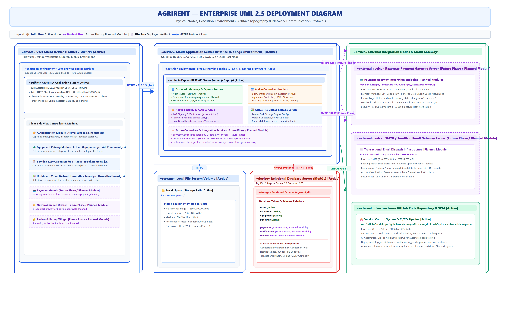
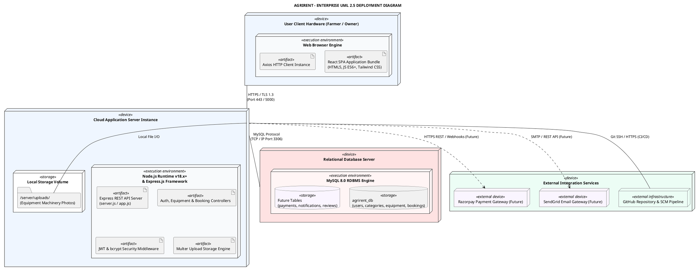

# AgriRent - Enterprise UML 2.5 Deployment Diagram Specification

**Project Name:** AgriRent – Agricultural Equipment Rental Marketplace  
**Document Version:** 1.0.0  
**Document Status:** Approved  
**Author:** DevOps & Cloud Systems Architecture Team  
**Target Location:** `docs/diagrams/11_deployment_diagram.md`  
**Diagram Assets:**  
- Editable Draw.io Source: [`docs/diagrams/deployment-diagram.drawio`](file:///c:/Users/sanja/OneDrive/Desktop/AgriRent/docs/diagrams/deployment-diagram.drawio)  
- High-Resolution Vector SVG: [`docs/diagrams/deployment-diagram.svg`](file:///c:/Users/sanja/OneDrive/Desktop/AgriRent/docs/diagrams/deployment-diagram.svg)  
- High-Resolution Image PNG: [`docs/diagrams/deployment-diagram.png`](file:///c:/Users/sanja/OneDrive/Desktop/AgriRent/docs/diagrams/deployment-diagram.png)  

---

## 1. Purpose

The purpose of this **UML 2.5 Deployment Diagram Specification** is to define the physical node topology, runtime execution environments, hardware specifications, artifact distribution, and network communication channels for **AgriRent** (Agricultural Equipment Rental Marketplace).

This document serves as an authoritative reference for:
- **Final Year Capstone Project Architectural Defense**
- **Cloud Infrastructure & DevOps Deployment Blueprints**
- **GitHub Engineering Portfolio Showcase**
- **Placement & Technical Systems Architecture Interviews**

It maps the physical mapping of client browsers, web runtime servers, local image storage volumes, relational MySQL databases, and external cloud payment & email gateways.

---

## 2. Enterprise Deployment Diagram Visualizations

### 2.1 High-Resolution Deployment Architecture (SVG / PNG)



---

### 2.2 PlantUML Deployment Specification



---

## 3. Physical & Execution Nodes Catalog

### 3.1 Client Tier (`«device» User Client Device`)

Represents the physical hardware end-user devices (smartphones, tablets, desktop workstations) operated by Farmers and Equipment Owners.

| Node Property | Value / Specification |
|---|---|
| **Device Type** | Desktop PC, Laptop, Tablet, Smartphone (iOS / Android) |
| **Operating System** | Windows, macOS, Linux, Android, iOS |
| **Execution Environment** | Modern Web Browser (Google Chrome v115+, Microsoft Edge, Mozilla Firefox, Apple Safari) |
| **Deployed Artifacts** | `React SPA Application Bundle` (Compiled HTML5, JS, CSS, Axios HTTP Client) |
| **Client State Storage** | Web Browser `LocalStorage` storing signed JSON Web Tokens (`jwt_token`) |

---

### 3.2 Application & Web Server Tier (`«device» Cloud Application Server`)

Represents the application host server running the Node.js backend services and hosting uploaded machinery images.

| Node Property | Value / Specification |
|---|---|
| **Host Environment** | Cloud Instance (AWS EC2 / DigitalOcean Droplet / Local Host Server) |
| **Operating System** | Ubuntu Server 22.04 LTS (x86_64 Architecture) |
| **Execution Environment** | Node.js Runtime Engine (v18.x LTS) with Express.js Framework (v4.x) |
| **Deployed Artifacts** | `app.js` / `server.js`, Express Routers (`/api/auth`, `/api/equipment`, `/api/bookings`), Controller Handlers, Auth Middlewares |
| **Local Disk Storage** | Mounted storage volume at `/server/uploads/` storing multipart uploaded equipment photos |
| **Listening Port** | Port `5000` (Reverse proxied via Nginx / HTTPS Port 443 in production) |

---

### 3.3 Relational Database Tier (`«device» Relational Database Server`)

Represents the database server instance hosting the persistent relational database engine.

| Node Property | Value / Specification |
|---|---|
| **Host Environment** | Dedicated DB Instance / Managed AWS RDS MySQL |
| **RDBMS Engine** | MySQL Server 8.0 (InnoDB Engine, ACID Transactional) |
| **Database Name** | `agrirent_db` |
| **Active Schema Tables** | `users`, `categories`, `equipment`, `bookings` |
| **Future Schema Tables** | `payments` *(Future)*, `notifications` *(Future)*, `reviews` *(Future)* |
| **Connection Pooling** | `mysql2/promise` Connection Pool (Default Pool Size: 10 connections) |
| **Database Port** | TCP / IP Port `3306` (Restricted to application server IP access) |

---

### 3.4 External Integration Nodes Tier (`«device» External Cloud Services`)

Third-party cloud infrastructure and integration gateways.

| External Node Name | Service Provider | Protocol & Port | Functionality |
|---|---|---|---|
| **Razorpay Payment Gateway** | Razorpay Cloud *(Future)* | HTTPS REST (Port 443) | Escrow payment processing, UPI checkout modals, payment verification webhooks. |
| **Email Notification Server** | SendGrid / SMTP *(Future)* | SMTP (Port 587 / 465) | Transactional email dispatches for booking alerts, approvals, and invoices. |
| **GitHub SCM Repository** | GitHub Cloud | Git SSH (Port 22) / HTTPS | Source code management, automated CI testing, release tagging. |

---

## 4. Communication Protocols & Network Topology

```
+---------------------------------------------------------------------------------------------------+
| NETWORK COMMUNICATION MATRIX                                                                      |
+----------------------+-----------------------+-------------------+-----------+--------------------+
| Source Node          | Destination Node      | Protocol / Scheme | Port      | Data Transferred   |
+----------------------+-----------------------+-------------------+-----------+--------------------+
| User Client Device   | Application Server    | HTTPS / TLS 1.3   | 443 / 5000| REST JSON / Form   |
| Application Server   | Local File System     | File System I/O   | Internal  | Multipart Images   |
| Application Server   | Database Server       | MySQL Protocol    | TCP 3306  | SQL Queries / Data |
| Application Server   | Razorpay Gateway (Fut)| HTTPS REST        | 443       | Escrow Payment API |
| Application Server   | Email Server (Future) | SMTP / TLS        | 587       | Transactional Email|
| Application Server   | GitHub Infrastructure | Git SSH / HTTPS   | 22 / 443  | SCM Code Pulls     |
+----------------------+-----------------------+-------------------+-----------+--------------------+
```

---

## 5. Security & Network Boundary Partitioning

```
[ User Client Device ] (Public Network Zone)
        |
        | Encrypted HTTPS / TLS 1.3 (Port 443)
        v
+-------------------------------------------------------------+
| FIREWALL / DEMARCATION ZONE                                 |
+-------------------------------------------------------------+
        |
        v
[ Cloud Application Server Instance ] (Private Subnet Zone)
  - CORS Middleware Restriction (Origin domain check)
  - Rate Limiting (express-rate-limit)
  - JWT Bearer Header Verification
  - Multer File Type Sanitization (.png, .jpg, .webp only)
        |
        +----------------------------+
        | Private VPC Network (3306) | Local File System Write
        v                            v
[ MySQL Database Server ]   [ /server/uploads/ Directory ]
```

1. **Transport Layer Security**: All communications between user browsers and the server use **TLS 1.3 encryption**.
2. **Access Security**: Express backend validates JWT signatures on protected routes using standard `Bearer <token>` headers.
3. **Database Network Isolation**: MySQL port 3306 is bound exclusively to `127.0.0.1` or the private cloud Virtual Private Cloud (VPC) IP.
4. **File Storage Protection**: Multer limits upload file size to 5 MB per image and validates MIME types to prevent malicious code execution.

---

## 6. Future Infrastructure Scaling Roadmap

To support high-concurrency peak harvesting seasons, the AgriRent deployment topology can scale as follows:

1. **Reverse Proxy & Load Balancing**:
   - Deploy **Nginx** or AWS ALB in front of multiple stateless Node.js application instances.
2. **Managed Cloud Database**:
   - Migrate local MySQL to **AWS RDS MySQL Multi-AZ** with Read Replicas for high availability.
3. **Cloud Object Storage (AWS S3)**:
   - Offload local `/server/uploads/` image files to **Amazon S3** backed by **Amazon CloudFront CDN** for worldwide fast asset loading.

---

## 7. Revision History

| Version | Date | Author / Role | Key Changes / Remarks |
|---|---|---|---|
| **1.0.0** | 2026-08-07 | DevOps Architecture Team | Initial Enterprise UML 2.5 Deployment Diagram release detailing client devices, application server node, MySQL DB node, upload storage volume, and external integrations. |
