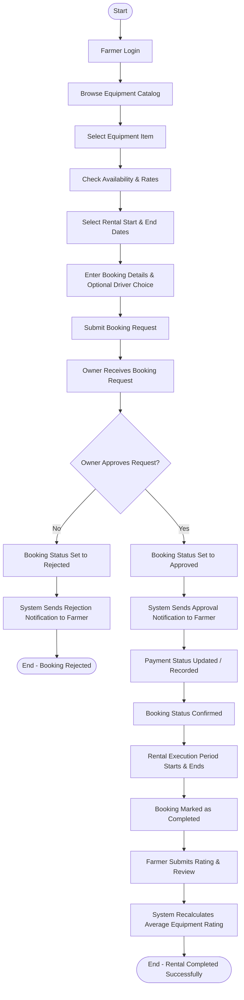

# Activity Diagram

## Overview

The Activity diagram models the end-to-end workflow of the main rental process in **AgriRent**, starting from farmer authentication, browsing and selecting equipment, to booking submission, owner approval/rejection, payment status tracking, and final review submission.

---

## Mermaid Activity Diagram

---

## Process Steps Description

1. **Farmer Authentication & Selection:** The farmer logs in, searches the equipment catalog, and selects target equipment.
2. **Date & Rate Calculation:** The farmer checks available dates, selects total rental days, chooses whether a driver is needed, and views the calculated total price.
3. **Booking Submission:** Submitting the booking creates a record in the database with status `pending`.
4. **Owner Approval Decision:**
   - **Reject:** The owner rejects the request. The booking status changes to `rejected`, the farmer is notified, and the workflow terminates.
   - **Approve:** The owner approves the request. The booking status updates to `approved`, and an approval notification is dispatched.
5. **Rental Completion & Payment:** Upon approval, payment details are updated, the rental period proceeds, and after completion, the booking status is set to `completed`.
6. **Feedback Loop:** The farmer submits a rating (1–5 stars) and review, triggering an automatic recalculation of the equipment's average rating.
