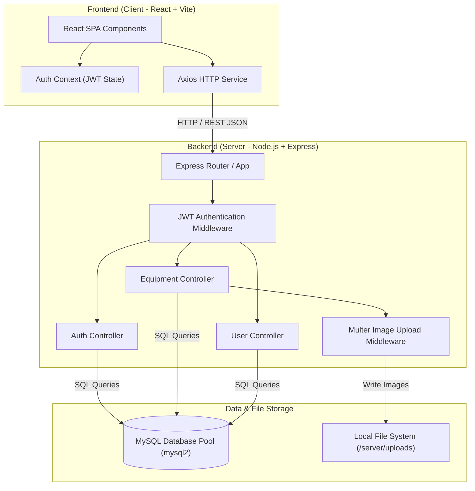

# AgriRent System Architecture Specification

## Architecture Overview

AgriRent follows a decoupled Client-Server RESTful architecture:

## Core Completed Modules & Data Flow

1. **Authentication & Authorization**:
   - Client sends registration/login payload to Express server (`/api/auth/register`, `/api/auth/login`).
   - Passwords encrypted with `bcrypt`.
   - JWT tokens generated with user identity (`id`, `role`) signed via `JWT_SECRET`.
   - `authMiddleware` validates Bearer token on protected routes and attaches user metadata to `req.user`.

2. **Equipment Management & Image Upload**:
   - Equipment Owners manage equipment listings (`GET /api/equipment`, `POST /api/equipment`, `PUT /api/equipment/:id`, `DELETE /api/equipment/:id`).
   - Image upload handled via `multer` storing files in `server/uploads/` directory and returning relative URL paths.
   - Equipment queried by category, location, and price ranges with pagination support from MySQL `equipment` table.
