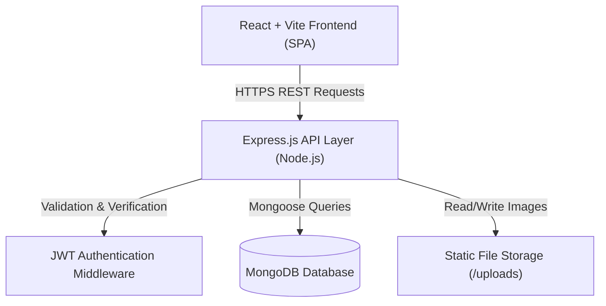

# AgriRent System Architecture Specification

## Architecture Overview

AgriRent follows a modern decoupled Client-Server architecture:

## Core Modules & Data Flow

1. **Authentication Flow**:
   - User inputs credentials on React Frontend.
   - Request sent to `/api/auth/login` or `/api/auth/register`.
   - Express server checks bcrypt hash and generates JWT token containing `userId` and `role`.
   - Token sent in HTTP Bearer header for subsequent protected requests.

2. **Equipment Discovery & Rental Flow**:
   - Farmer views equipment catalog filtered by category, location, and rate.
   - Frontend requests `/api/equipment?category=Tractor&location=Punjab`.
   - Farmer submits booking with `startDate`, `endDate`, and `includeDriver`.
   - Backend `bookingService` checks date overlaps on active bookings and creates booking record in `Pending` state.
   - Equipment Owner receives request on Owner Dashboard and accepts or rejects the booking.
