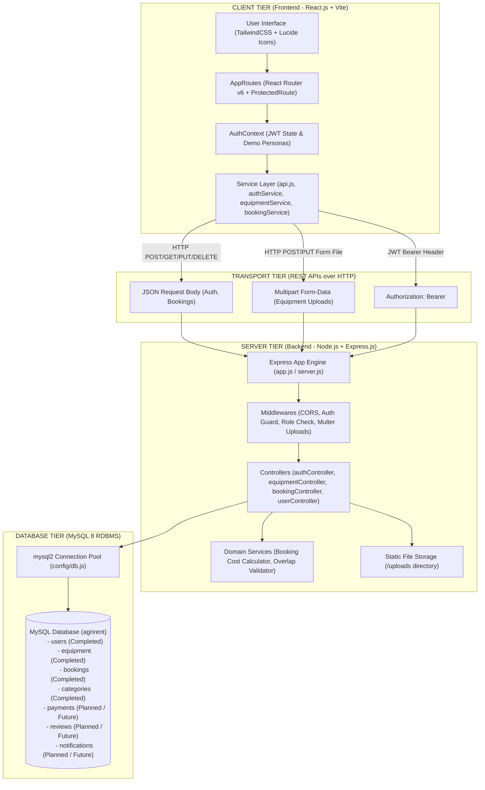
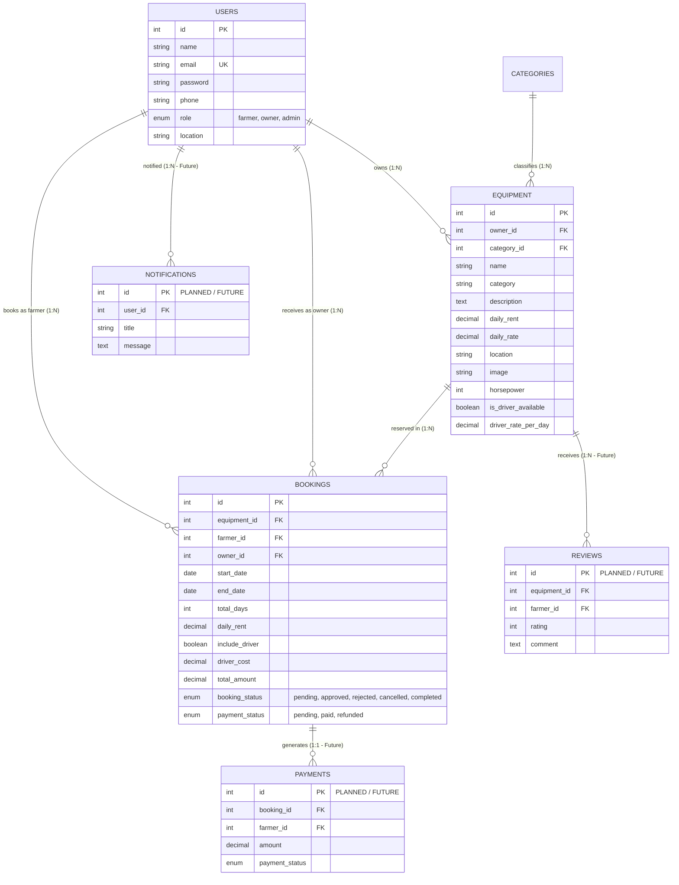

# AGRIRENT: SYSTEM ARCHITECTURE SPECIFICATION
**Project Title:** Agricultural Equipment Rental Marketplace  
**Capstone Stage:** Capstone Review-I (Day 11)  
**Target File Path:** `docs/diagrams/architecture.md`  
**Technology Stack:** React.js, Vite, Node.js, Express.js, MySQL 8, JWT, Multer, TailwindCSS

---

## 1. HIGH-LEVEL SYSTEM ARCHITECTURE DIAGRAM



---

## 2. SYSTEM TIER SPECIFICATIONS

### Tier 1: Frontend Client Layer (React.js + Vite)
- **Framework & Build Engine**: React 18 single-page application built with Vite.
- **Client-Side Routing**: `React Router v6` (`AppRoutes.jsx`) managing application routes.
- **Authentication State**: `AuthContext.jsx` centralizes user auth state, demo role personas (Farmer, Owner, Admin), and JWT token management in `localStorage`.
- **Route Protection**: `ProtectedRoute` component guards restricted dashboard and form routes (`/farmer-dashboard`, `/owner-dashboard`, `/admin-dashboard`, `/equipment/new`, `/equipment/:id/edit`, `/profile`), redirecting unauthenticated visitors to `/login`.
- **API Services**: Modular service layer (`api.js`, `authService.js`, `equipmentService.js`, `bookingService.js`, `userService.js`) utilizing `fetchWithAuth` to inject `Authorization: Bearer <token>` headers.

### Tier 2: Backend API Layer (Node.js + Express.js)
- **REST API Engine**: Express application (`app.js` / `server.js`) providing modular REST API endpoints.
- **Authentication & Security Middleware**:
  - `authMiddleware.js`: `protect` validates incoming JWT tokens; `authorizeRoles('farmer', 'owner', 'admin')` enforces Role-Based Access Control (RBAC).
  - Password Encryption: `bcryptjs` hashing for user passwords.
- **Image Upload Middleware**:
  - `uploadMiddleware.js`: `multer` disk storage handling machinery photo uploads to the `/uploads/` static directory.
- **API Controllers**:
  - `authController.js`: Manages registration, login authentication, user profile.
  - `equipmentController.js`: Manages catalog listing, multi-parameter search/filters, machine specs view, listing creation, updates, and deletion.
  - `bookingController.js`: Manages reservation requests, date overlap checks (`hasBookingConflict`), pricing calculations (`calculateBookingCost`), owner approvals/rejections, and farmer cancellations.
  - `userController.js`: Handles user management operations.

### Tier 3: Database & Data Persistence (MySQL 8 RDBMS)
- **Database Connection**: `mysql2/promise` connection pool (`config/db.js`) connecting to MySQL `agrirent` database.
- **User Roles Supported**:
  - 🌾 **Farmer**: Browses machinery catalog, filters equipment, creates rental requests, tracks booking status.
  - 🚜 **Owner**: Lists machinery fleet, sets rental rates, accepts/rejects rental requests, edits equipment specs.
  - 🛡️ **Admin**: System overview, platform user monitoring, category management.

---

## 3. COMPONENT IMPLEMENTATION & MODULE STATUS

| Module | Implementation Status | Key Components & Files | Database Tables Involved |
| :--- | :---: | :--- | :--- |
| **Authentication Module** | **Completed (Review-I Verified)** | `Login.jsx`, `Register.jsx`, `AuthContext.jsx`, `authRoutes.js`, `authController.js` | `users` |
| **Equipment Module** | **Completed (Review-I Verified)** | `Equipment.jsx`, `EquipmentDetails.jsx`, `EquipmentForm.jsx`, `uploadMiddleware.js`, `equipmentRoutes.js`, `equipmentController.js` | `equipment`, `categories`, `users` |
| **Booking Module** | **Completed (Review-I Verified)** | `Booking.jsx`, `FarmerDashboard.jsx`, `OwnerDashboard.jsx`, `bookingRoutes.js`, `bookingController.js` | `bookings`, `equipment`, `users` |
| **Payment Module** | ⏳ **Planned / Future Module** | Payment processing & gateway integration (Stripe / Razorpay webhooks) | `payments` (Schema defined, module planned for future phase) |
| **Review & Rating Module** | ⏳ **Planned / Future Module** | Post-rental farmer reviews and rating submissions | `reviews` (Schema defined, module planned for future phase) |
| **Notification Module** | ⏳ **Planned / Future Module** | Real-time event notifications & email alerts | `notifications` (Schema defined, module planned for future phase) |

---

## 4. END-TO-END WORKFLOW SEQUENCES

### Workflow 1: Authentication Flow
```
User (Client) → Login/Register Form → authService.js → POST /api/auth/login → authController.js 
  → MySQL users table lookup / bcrypt compare → JWT Token generated 
  → Returned to Frontend → Stored in localStorage & AuthContext → Protected Routes accessible
```

### Workflow 2: Equipment Listing & Management Flow (Owner)
```
Owner (Client) → EquipmentForm.jsx → equipmentService.js → POST /api/equipment (Multipart Form-Data)
  → uploadMiddleware (Multer saves file to /uploads) → equipmentController.js 
  → INSERT INTO equipment table → 201 Created → Redirect to Equipment Details / Dashboard
```

### Workflow 3: Booking & Reservation Flow (Farmer & Owner)
```
Farmer → Booking.jsx → POST /api/bookings → bookingController.js
  → validateDateRange() → hasBookingConflict() → calculateBookingCost()
  → INSERT INTO bookings (status: 'pending') → Redirect to Farmer Dashboard
Owner → OwnerDashboard.jsx → GET /api/bookings/owner → View pending request
  → PUT /api/bookings/:id/approve → UPDATE bookings SET booking_status='approved' 
  → UI updates to Approved status
```

---

## 5. DATABASE ENTITY-RELATIONSHIP MODEL


