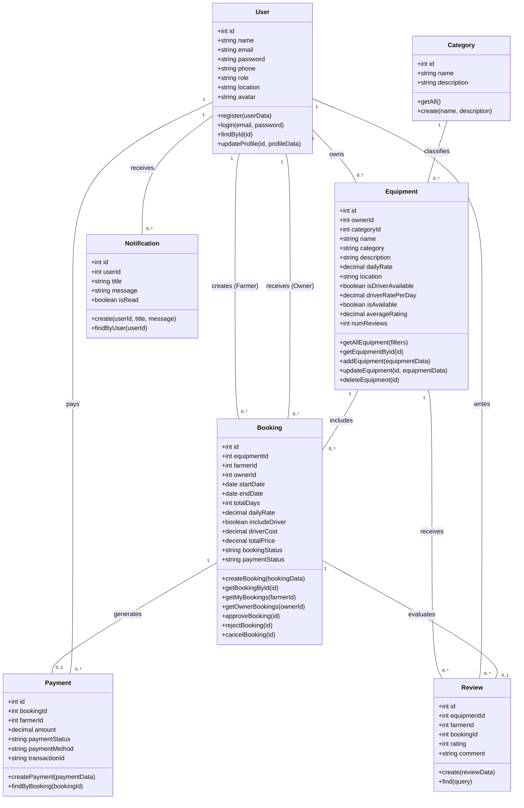

# Class Diagram

## Overview

The Conceptual Class diagram models the primary domain entities, data attributes, controller/model methods, and relationships within the **AgriRent** application. It reflects the object-oriented structure implemented across `server/models/` and `server/controllers/`.

---

## Mermaid Class Diagram

---

## Class Responsibilities

1. **`User` Class:** Manages user authentication, password comparison via bcrypt, JWT token generation, role verification (`farmer`, `owner`, `admin`), and profile updates.
2. **`Category` Class:** Provides classification lookup functions for organizing equipment listings.
3. **`Equipment` Class:** Handles creation, filtering, editing, availability toggling, and average rating updates for machinery.
4. **`Booking` Class:** Encapsulates core business rules for rentals including rental duration calculation, total cost estimation (rates + driver fees), and status transitions (`pending` → `approved`/`rejected` → `completed`/`cancelled`).
5. **`Payment` Class:** Records transaction logs associated with confirmed rental bookings.
6. **`Review` Class:** Captures user ratings (1 to 5 stars) and feedback text, recalculating equipment average ratings upon creation.
7. **`Notification` Class:** Dispatches in-app notifications to users when relevant booking events occur.
