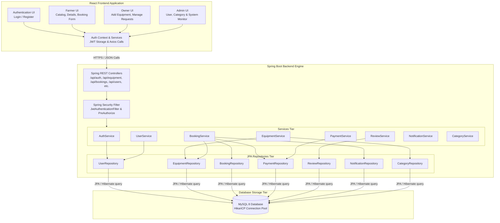

# Component Diagram

## Overview

The Component diagram illustrates the structural organization of the **AgriRent** software system. It shows how the modular frontend user interfaces, backend Spring Boot controllers, security filters, services, JPA repositories, and the relational MySQL database interact.

---

## Mermaid Component Diagram

---

## Component Roles & Interactions

### 1. Frontend Components (`client/src/`)
- **Authentication UI (`Login.jsx`, `Register.jsx`):** Captures user credentials and dispatches auth requests.
- **Farmer UI (`Equipment.jsx`, `EquipmentDetails.jsx`, `Booking.jsx`, `FarmerDashboard.jsx`):** Enables farmers to browse machinery, view pricing/driver rates, submit rental requests, and view booking status.
- **Owner UI (`EquipmentForm.jsx`, `OwnerDashboard.jsx`):** Allows owners to list new equipment, update specifications, and approve or reject incoming rental requests.
- **Admin UI (`AdminDashboard.jsx`):** Provides system oversight for managing platform categories, monitoring users, and viewing all platform bookings.
- **Auth Context (`AuthContext.jsx`):** Encapsulates JWT storage in local memory and attaches authorization headers to outgoing API calls.

### 2. Backend Server Components (`server/springboot-backend/`)
- **Spring REST Controllers (`com.agrirent.controller`):** Map incoming REST request endpoints to service calls.
- **Spring Security Filter (`com.agrirent.security`):** Intercepts requests to verify JWT signature and check user roles via `JwtAuthenticationFilter`.
- **Services (`com.agrirent.service`):** Execute business logic, compute prices, handle driver costs, and validate input parameters.
- **JPA Repositories (`com.agrirent.repository`):** Standard Spring Data JPA interfaces for database operations (`save`, `findById`, `findAll`, `deleteById`).

### 3. Database Components (`agrirent` MySQL DB)
- **HikariCP Connection Pool:** Manages high-performance persistent connections to MySQL 8 on port 3306.
