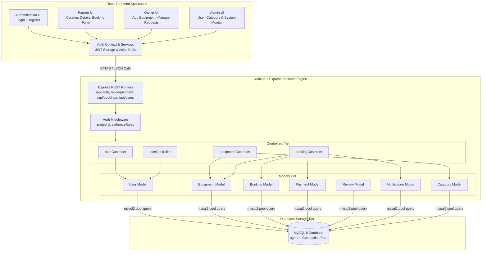

# Component Diagram

## Overview

The Component diagram illustrates the structural organization of the **AgriRent** software system. It shows how the modular frontend user interfaces, backend API services/controllers, security middleware, data models, and the relational MySQL database interact.

---

## Mermaid Component Diagram

---

## Component Roles & Interactions

### 1. Frontend Components (`client/src/`)
- **Authentication UI (`Login.jsx`, `Register.jsx`):** Captures user credentials and dispatches auth requests.
- **Farmer UI (`Equipment.jsx`, `EquipmentDetails.jsx`, `Booking.jsx`, `FarmerDashboard.jsx`):** Enables farmers to browse machinery, view pricing/driver rates, submit rental requests, and view booking status.
- **Owner UI (`EquipmentForm.jsx`, `OwnerDashboard.jsx`):** Allows owners to list new equipment, update specifications, and approve or reject incoming rental requests.
- **Admin UI (`AdminDashboard.jsx`):** Provides system oversight for managing platform categories, monitoring users, and viewing all platform bookings.
- **Auth Context (`AuthContext.jsx`):** Encapsulates JWT storage in local memory and attaches authorization headers to outgoing API calls.

### 2. Backend Server Components (`server/`)
- **Express REST Routers (`server/routes/`):** Route incoming request paths to their corresponding controller methods.
- **Auth Middleware (`authMiddleware.js`):** Intercepts requests to verify JWT signature and check user roles.
- **Controllers (`server/controllers/`):** Execute business logic, compute prices, and validate input parameters.
- **Models (`server/models/`):** Abstract MySQL queries into JavaScript methods (`find`, `create`, `update`, `delete`).

### 3. Database Components (`agrirent` MySQL DB)
- **`mysql2` Connection Pool:** Manages persistent pool connections to MySQL 8 on port 3306 for optimal performance.
