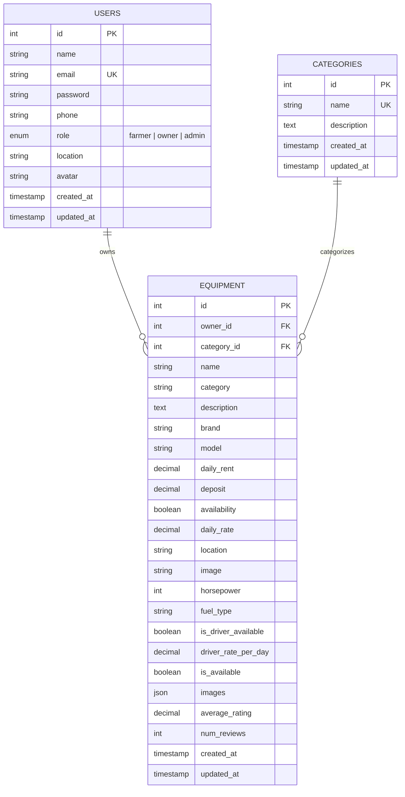

# Database Schema & Entity Relationships

> **Scope**: Current Completed Modules (Users / Authentication, Categories, Equipment Management). Excludes pending modules (Booking, Payment, Notifications).

## Entity Relationship Diagram

## Relational Database Schema Tables (MySQL 8.0)

### 1. `users` Table
- **Primary Key**: `id` (INT, AUTO_INCREMENT)
- **Unique Keys**: `email` (VARCHAR 100)
- **Indexes**: `idx_users_email` (`email`), `idx_users_role` (`role`)
- **Fields**: `id`, `name`, `email`, `password`, `phone`, `role`, `location`, `avatar`, `created_at`, `updated_at`

### 2. `categories` Table
- **Primary Key**: `id` (INT, AUTO_INCREMENT)
- **Unique Keys**: `name` (VARCHAR 50)
- **Fields**: `id`, `name`, `description`, `created_at`, `updated_at`

### 3. `equipment` Table
- **Primary Key**: `id` (INT, AUTO_INCREMENT)
- **Foreign Keys**:
  - `owner_id` references `users(id)` ON DELETE CASCADE
  - `category_id` references `categories(id)` ON DELETE SET NULL
- **Indexes**: `idx_equipment_owner`, `idx_equipment_category`, `idx_equipment_category_id`, `idx_equipment_location`
- **Fields**: `id`, `owner_id`, `category_id`, `name`, `category`, `description`, `brand`, `model`, `daily_rent`, `deposit`, `availability`, `daily_rate`, `location`, `image`, `horsepower`, `fuel_type`, `is_driver_available`, `driver_rate_per_day`, `is_available`, `images`, `average_rating`, `num_reviews`, `created_at`, `updated_at`
