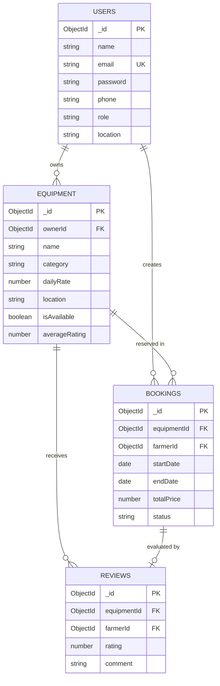

# Database Schema & Entity Relationships

```mermaid
erDiagram
    USERS ||--o{ EQUIPMENT : "owns"
    USERS ||--o{ BOOKINGS : "creates"
    EQUIPMENT ||--o{ BOOKINGS : "reserved in"
    EQUIPMENT ||--o{ REVIEWS : "receives"
    BOOKINGS ||--o| REVIEWS : "evaluated by"

    USERS {
        ObjectId _id PK
        string name
        string email UK
        string password
        string phone
        string role
        string location
    }

    EQUIPMENT {
        ObjectId _id PK
        ObjectId ownerId FK
        string name
        string category
        number dailyRate
        string location
        boolean isAvailable
        number averageRating
    }

    BOOKINGS {
        ObjectId _id PK
        ObjectId equipmentId FK
        ObjectId farmerId FK
        date startDate
        date endDate
        number totalPrice
        string status
    }

    REVIEWS {
        ObjectId _id PK
        ObjectId equipmentId FK
        ObjectId farmerId FK
        number rating
        string comment
    }
```
