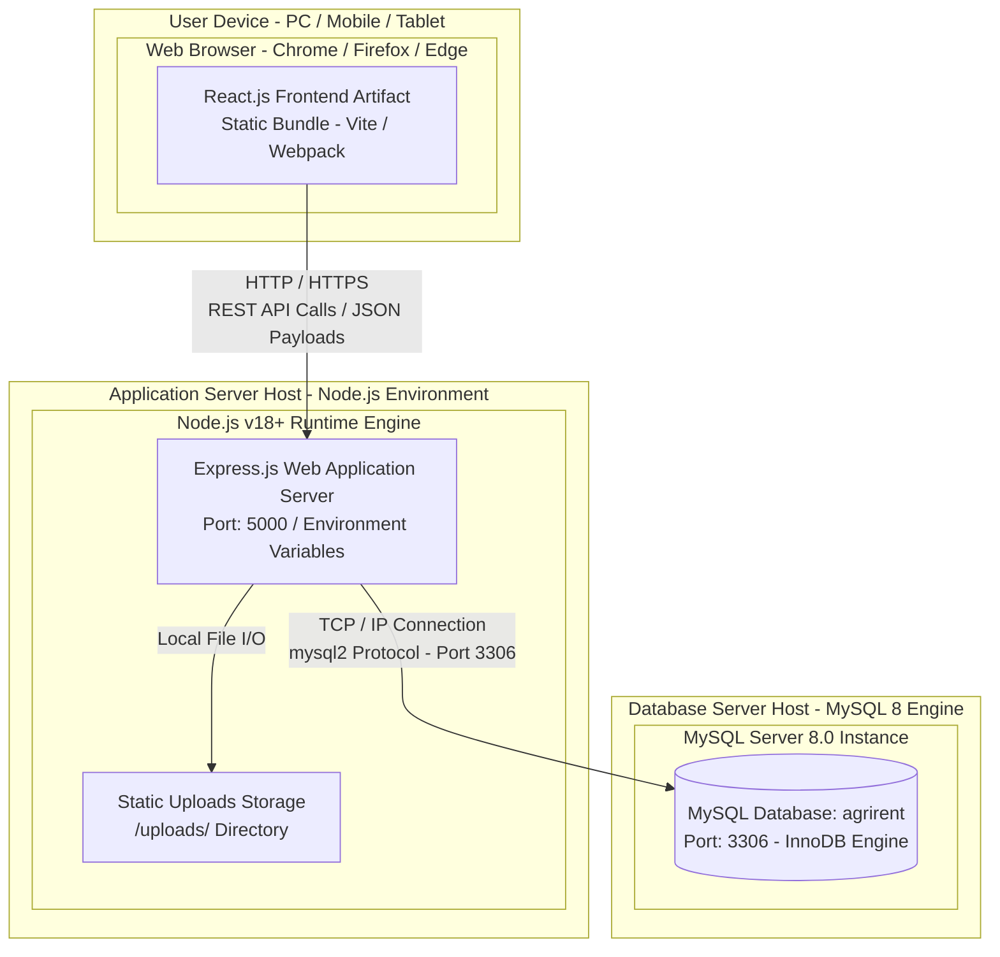

# Deployment Diagram

## Overview

The Deployment diagram illustrates the physical and runtime deployment setup of the **AgriRent** application. Designed as a practical student capstone deployment topology, it shows how software components are hosted across user client devices, the web server host, and the database server instance.

---

## Mermaid Deployment Diagram

---

## Deployment Node Details

### 1. User Device (Client Node)
- **Hardware:** Desktop computers, laptops, tablets, or smartphones.
- **Runtime Environment:** Any modern web browser (Google Chrome, Mozilla Firefox, Microsoft Edge, Safari).
- **Artifact:** Renders the React client application single-page application (SPA).

### 2. Application Server (Backend Server Node)
- **Host Environment:** Local workstation or web server running Node.js (v18+).
- **Runtime Process:** Listens for HTTP requests on a designated port (e.g., `http://localhost:5000` or production host).
- **Execution Component:** Express.js framework handling routing, JWT authentication, and image file storage in the local `/uploads/` directory.

### 3. Database Server (MySQL Node)
- **Host Environment:** Local or dedicated MySQL Server 8.0 instance.
- **Service Configuration:** Listens on standard MySQL TCP port `3306`.
- **Database Engine:** MySQL InnoDB engine managing 7 relational tables with Foreign Keys and transactional integrity.
