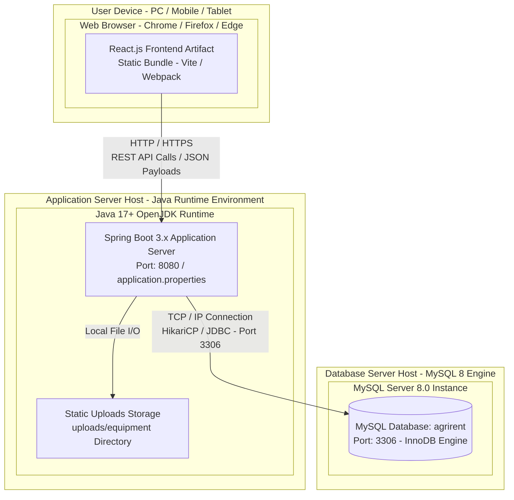

# Deployment Diagram

## Overview

The Deployment diagram illustrates the physical and runtime deployment setup of the **AgriRent** application. It shows how software components are hosted across user client devices, the Spring Boot application server host, and the database server instance.

---

## Mermaid Deployment Diagram

---

## Deployment Node Details

### 1. User Device (Client Node)
- **Hardware:** Desktop computers, laptops, tablets, or smartphones.
- **Runtime Environment:** Any modern web browser (Google Chrome, Mozilla Firefox, Microsoft Edge, Safari).
- **Artifact:** Renders the React client application single-page application (SPA).

### 2. Application Server (Backend Server Node)
- **Host Environment:** Workstation or server running Java 17+ JRE/JDK.
- **Runtime Process:** Executable JAR (`agrirent-backend-1.0.0.jar`) built via Apache Maven, listening on port `8080`.
- **Execution Component:** Spring Boot web server handling Spring Security JWT authentication, JPA persistence, and image file storage in the local `uploads/equipment` directory.

### 3. Database Server (MySQL Node)
- **Host Environment:** Local or dedicated MySQL Server 8.0 instance.
- **Service Configuration:** Listens on standard MySQL TCP port `3306`.
- **Database Engine:** MySQL InnoDB engine managing 7 relational tables with Foreign Keys and transactional integrity.
