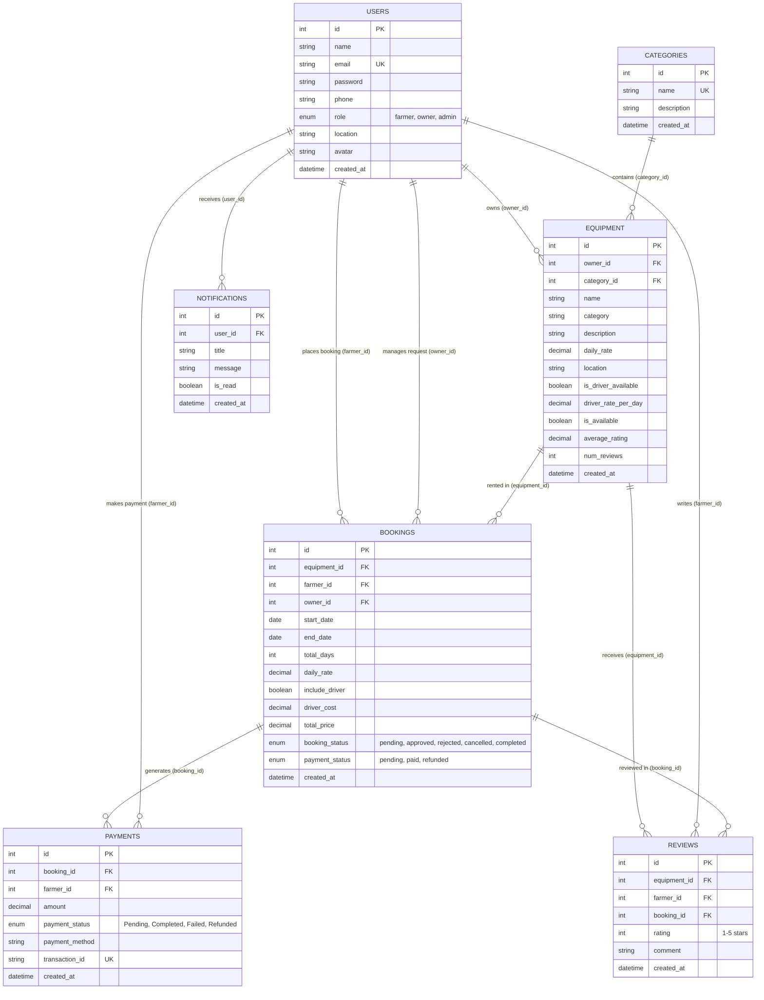

# Entity Relationship (ER) Diagram

## Overview

The Entity Relationship diagram presents the database structure of the **AgriRent** application. It maps the 7 relational tables in the MySQL `agrirent` database, showing primary keys, foreign keys, key attributes, and relationship cardinalities derived directly from `server/config/schema.sql`.

---

## Mermaid ER Diagram

---

## Relationship Explanations

1. **USERS to EQUIPMENT (1:N):** One equipment owner can list multiple pieces of agricultural equipment (`equipment.owner_id` → `users.id`).
2. **CATEGORIES to EQUIPMENT (1:N):** A category can contain multiple equipment items (`equipment.category_id` → `categories.id`).
3. **EQUIPMENT to BOOKINGS (1:N):** An equipment item can have multiple rental booking requests over time (`bookings.equipment_id` → `equipment.id`).
4. **USERS to BOOKINGS (1:N):**
   - As a **Farmer**: A farmer can create multiple rental bookings (`bookings.farmer_id` → `users.id`).
   - As an **Owner**: An owner receives and responds to multiple booking requests for their equipment (`bookings.owner_id` → `users.id`).
5. **BOOKINGS to PAYMENTS (1:N / 1:1):** A booking generates payment transaction logs (`payments.booking_id` → `bookings.id`).
6. **USERS to PAYMENTS (1:N):** A farmer makes payments associated with their account (`payments.farmer_id` → `users.id`).
7. **EQUIPMENT / USERS / BOOKINGS to REVIEWS (1:N):** A farmer writes reviews for completed bookings of specific equipment (`reviews.equipment_id`, `reviews.farmer_id`, `reviews.booking_id`).
8. **USERS to NOTIFICATIONS (1:N):** System notifications are addressed to a specific user (`notifications.user_id` → `users.id`).
