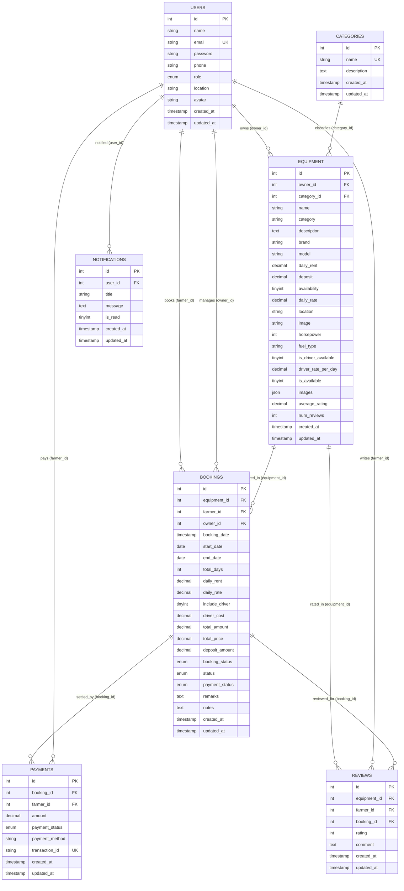

# AGRIRENT: ENTERPRISE ENTITY-RELATIONSHIP (ER) DIAGRAM SPECIFICATION
**Project Title:** Agricultural Equipment Rental Marketplace  
**Capstone Stage:** Capstone Review-I (Day 11)  
**Database Engine:** MySQL 8 RDBMS (`agrirent`)  
**Target Path:** `docs/diagrams/er-diagram.md`  

---

## 1. OFFICIAL ENTITY-RELATIONSHIP (ER) DIAGRAM

---

## 2. ENTITY SPECIFICATION CATALOG (EXACT MATCH TO SCHEMA.SQL)

### 2.1 Entity: `users`
* **Purpose**: Manages user authentication credentials, contact details, and role authority levels (`farmer`, `owner`, `admin`).
* **Primary Key (PK)**: `id` (INT AUTO_INCREMENT)
* **Unique Key (UK)**: `email` (VARCHAR(100) UNIQUE)
* **Attributes**: `name`, `email`, `password`, `phone`, `role`, `location`, `avatar`, `created_at`, `updated_at`

### 2.2 Entity: `categories`
* **Purpose**: Stores machinery category lookup records (e.g. Tractor, Harvester, Tiller, Seeder, Sprayer, General).
* **Primary Key (PK)**: `id` (INT AUTO_INCREMENT)
* **Unique Key (UK)**: `name` (VARCHAR(50) UNIQUE)
* **Attributes**: `name`, `description`, `created_at`, `updated_at`

### 2.3 Entity: `equipment`
* **Purpose**: Stores agricultural machinery listings published by equipment lenders.
* **Primary Key (PK)**: `id` (INT AUTO_INCREMENT)
* **Foreign Keys (FK)**: 
  - `owner_id` → `users(id)` ON DELETE CASCADE
  - `category_id` → `categories(id)` ON DELETE SET NULL
* **Attributes**: `owner_id`, `category_id`, `name`, `category`, `description`, `brand`, `model`, `daily_rent`, `deposit`, `availability`, `daily_rate`, `location`, `image`, `horsepower`, `fuel_type`, `is_driver_available`, `driver_rate_per_day`, `is_available`, `images`, `average_rating`, `num_reviews`, `created_at`, `updated_at`

### 2.4 Entity: `bookings`
* **Purpose**: Tracks machinery rental reservations, date ranges, status transitions (`pending`, `approved`, `rejected`, `cancelled`, `completed`), and cost calculations.
* **Primary Key (PK)**: `id` (INT AUTO_INCREMENT)
* **Foreign Keys (FK)**:
  - `equipment_id` → `equipment(id)` ON DELETE CASCADE
  - `farmer_id` → `users(id)` ON DELETE CASCADE
  - `owner_id` → `users(id)` ON DELETE CASCADE
* **Attributes**: `equipment_id`, `farmer_id`, `owner_id`, `booking_date`, `start_date`, `end_date`, `total_days`, `daily_rent`, `daily_rate`, `include_driver`, `driver_cost`, `total_amount`, `total_price`, `deposit_amount`, `booking_status`, `status`, `payment_status`, `remarks`, `notes`, `created_at`, `updated_at`

### 2.5 Entity: `payments`
* **Purpose**: Records financial payment transactions for rental bookings.
* **Primary Key (PK)**: `id` (INT AUTO_INCREMENT)
* **Foreign Keys (FK)**:
  - `booking_id` → `bookings(id)` ON DELETE CASCADE
  - `farmer_id` → `users(id)` ON DELETE CASCADE
* **Unique Key (UK)**: `transaction_id` (VARCHAR(100) UNIQUE)
* **Attributes**: `booking_id`, `farmer_id`, `amount`, `payment_status`, `payment_method`, `transaction_id`, `created_at`, `updated_at`

### 2.6 Entity: `reviews`
* **Purpose**: Stores rating scale (1-5 stars) and text feedback submitted by farmers after equipment rentals.
* **Primary Key (PK)**: `id` (INT AUTO_INCREMENT)
* **Foreign Keys (FK)**:
  - `equipment_id` → `equipment(id)` ON DELETE CASCADE
  - `farmer_id` → `users(id)` ON DELETE CASCADE
  - `booking_id` → `bookings(id)` ON DELETE CASCADE
* **Attributes**: `equipment_id`, `farmer_id`, `booking_id`, `rating`, `comment`, `created_at`, `updated_at`

### 2.7 Entity: `notifications`
* **Purpose**: Stores system alerts and rental event notification messages for platform users.
* **Primary Key (PK)**: `id` (INT AUTO_INCREMENT)
* **Foreign Keys (FK)**:
  - `user_id` → `users(id)` ON DELETE CASCADE
* **Attributes**: `user_id`, `title`, `message`, `is_read`, `created_at`, `updated_at`

---

## 3. CARDINALITY & RELATIONSHIP SUMMARY MATRIX

| Parent Entity (1) | Child Entity (N) | Relationship | Foreign Key Field | Business Meaning |
| :--- | :--- | :---: | :--- | :--- |
| `users` | `equipment` | **1 : N** | `equipment.owner_id` | Equipment Owner publishes 1 or more machinery listings. |
| `users` | `bookings` | **1 : N** | `bookings.farmer_id` | Farmer submits 1 or more rental bookings. |
| `users` | `bookings` | **1 : N** | `bookings.owner_id` | Equipment Owner manages 1 or more rental bookings. |
| `categories` | `equipment` | **1 : N** | `equipment.category_id` | Category classifies 1 or more machinery items. |
| `equipment` | `bookings` | **1 : N** | `bookings.equipment_id` | Equipment item receives 1 or more rental bookings over time. |
| `bookings` | `payments` | **1 : N** | `payments.booking_id` | Booking reservation generates payment transaction records. |
| `users` | `payments` | **1 : N** | `payments.farmer_id` | Farmer executes 1 or more rental payments. |
| `equipment` | `reviews` | **1 : N** | `reviews.equipment_id` | Equipment item receives 1 or more farmer reviews. |
| `users` | `reviews` | **1 : N** | `reviews.farmer_id` | Farmer writes 1 or more equipment reviews. |
| `bookings` | `reviews` | **1 : N** | `reviews.booking_id` | Booking reservation receives 1 review upon completion. |
| `users` | `notifications` | **1 : N** | `notifications.user_id` | User receives 1 or more alert notifications. |
