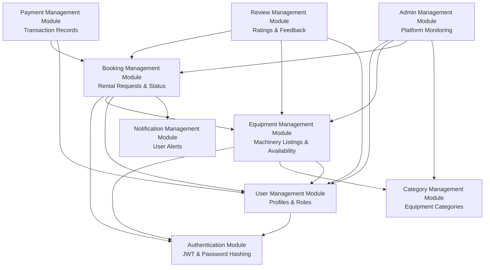

# Module Dependency Diagram

## Overview

The Module Dependency diagram shows the high-level functional modules of the **AgriRent** application and the exact dependencies between them. Connections exist only where modules explicitly invoke services or reference foreign key relationships in the codebase.

---

## Mermaid Module Diagram

---

## Module Descriptions & Dependencies

1. **Authentication Module:** Provides JWT generation, token verification (`protect`), and role checking (`authorizeRoles`).
2. **User Management Module:** Handles user registration, login, profile updates, and role validation (`farmer`, `owner`, `admin`). *Depends on Auth Module.*
3. **Category Management Module:** Stores machinery categories used to filter equipment listings.
4. **Equipment Management Module:** Manages equipment listings, rates, availability toggles, and driver options. *Depends on Auth, User (owner), and Category modules.*
5. **Booking Management Module:** Core rental logic handling dates, pricing, driver costs, and status transitions (`pending`, `approved`, `rejected`, `completed`). *Depends on Auth, User (farmer/owner), Equipment, and Notification modules.*
6. **Payment Management Module:** Records payment transaction logs for bookings. *Depends on Booking and User modules.*
7. **Review Management Module:** Enables farmers to leave star ratings and comments for completed bookings, recalculating equipment rating metrics. *Depends on Booking, Equipment, and User modules.*
8. **Notification Management Module:** Dispatches in-app notifications to users upon booking events.
9. **Admin Management Module:** Oversees system-wide user accounts, categories, equipment, and rental bookings. *Depends on User, Category, Equipment, and Booking modules.*
