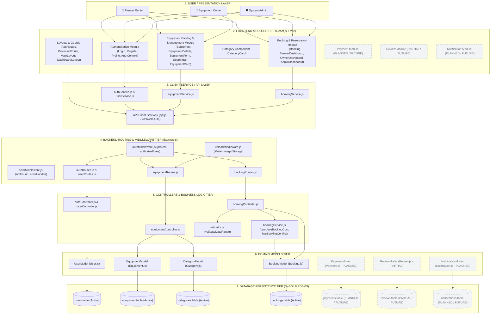
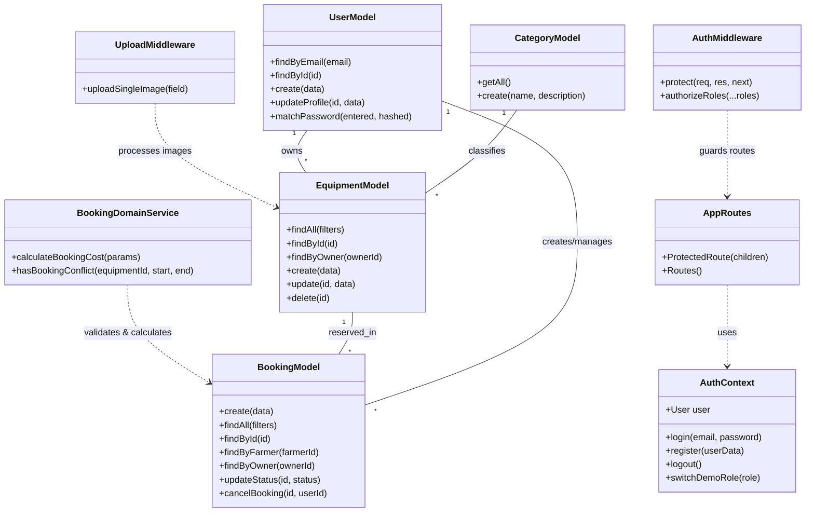

# AGRIRENT: SYSTEM MODULE & CLASS DIAGRAM SPECIFICATION
**Project Title:** Agricultural Equipment Rental Marketplace  
**Capstone Stage:** Capstone Review-I (Day 11)  
**Target File Path:** `docs/diagrams/module-diagram.md`  

---

## 1. LAYERED MODULE & ARCHITECTURE DIAGRAM

---

## 2. CLASS & MODULE INTERACTION CATALOG

### 2.1 Active Core Modules (Review-I Verified)

#### 1. Authentication & User Management
- **Frontend Components**: `Login.jsx`, `Register.jsx`, `Profile.jsx`, `AuthContext.jsx` (`AuthProvider`, `useAuth`), `authService.js`, `userService.js`
- **Backend Infrastructure**: `authRoutes.js`, `userRoutes.js`, `authController.js`, `userController.js`
- **Model**: `UserModel` (`User.js` - `findByEmail`, `findById`, `create`, `updateProfile`, `getAll`, `matchPassword`)
- **Middleware Guard**: `authMiddleware.js` (`protect` - JWT token validation)
- **Database Entity**: `users`

#### 2. Equipment Management
- **Frontend Components**: `Equipment.jsx`, `EquipmentDetails.jsx`, `EquipmentForm.jsx`, `EquipmentCard.jsx`, `SearchBar.jsx`, `equipmentService.js`
- **Backend Infrastructure**: `equipmentRoutes.js`, `equipmentController.js`
- **Model**: `EquipmentModel` (`Equipment.js` - `findAll`, `findById`, `findByOwner`, `create`, `update`, `delete`)
- **Middleware Guards**: `authMiddleware.js` (`protect`, `authorizeRoles('owner', 'admin')`), `uploadMiddleware.js` (Multer disk storage)
- **Database Entities**: `equipment`, `categories`

#### 3. Booking & Reservation Management
- **Frontend Components**: `Booking.jsx`, `FarmerDashboard.jsx`, `OwnerDashboard.jsx`, `AdminDashboard.jsx`, `bookingService.js`
- **Backend Infrastructure**: `bookingRoutes.js`, `bookingController.js`
- **Business Logic Services**: `services/bookingService.js` (`calculateBookingCost`, `hasBookingConflict`), `utils/validator.js` (`validateDateRange`)
- **Model**: `BookingModel` (`Booking.js` - `create`, `findAll`, `findById`, `findByFarmer`, `findByOwner`, `updateStatus`, `cancelBooking`, `delete`)
- **Middleware Guard**: `authMiddleware.js` (`protect`, `authorizeRoles`)
- **Database Entity**: `bookings`

#### 4. Category & Classification
- **Frontend Component**: `CategoryCard.jsx`
- **Backend Integration**: Integrated equipment filter logic
- **Model**: `CategoryModel` (`Category.js` - `getAll`, `create`)
- **Database Entity**: `categories`

#### 5. Core Infrastructure & Security
- **Frontend Components**: `AppRoutes.jsx` (`ProtectedRoute`), `api.js` (`fetchWithAuth`, `getImageUrl`), `MainLayout.jsx`, `DashboardLayout.jsx`
- **Backend Middleware**: `authMiddleware.js`, `uploadMiddleware.js`, `errorMiddleware.js`, `db.js` (mysql2 pool)
- **Entry Points**: `app.js` / `server.js`

---

### 2.2 Future / Planned Modules (Explicitly Labelled)

| Module Name | Status | Components / Files | Planned Functionality |
| :--- | :---: | :--- | :--- |
| **Payment Module** | **PLANNED / FUTURE** | `Payment.js` model (`payments` table) | Stripe / Razorpay escrow gateway webhooks & automated invoices |
| **Review & Rating Module** | **PARTIAL / FUTURE** | `Review.js` model (`reviews` table), rendered on `EquipmentDetails.jsx` | Post-rental rating submission & feedback submission form |
| **Notification Module** | **PLANNED / FUTURE** | `Notification.js` model (`notifications` table) | In-app notification drawer & automated email alert dispatch |

---

## 3. CLASS DIRECTORY & RELATIONSHIP MATRIX

