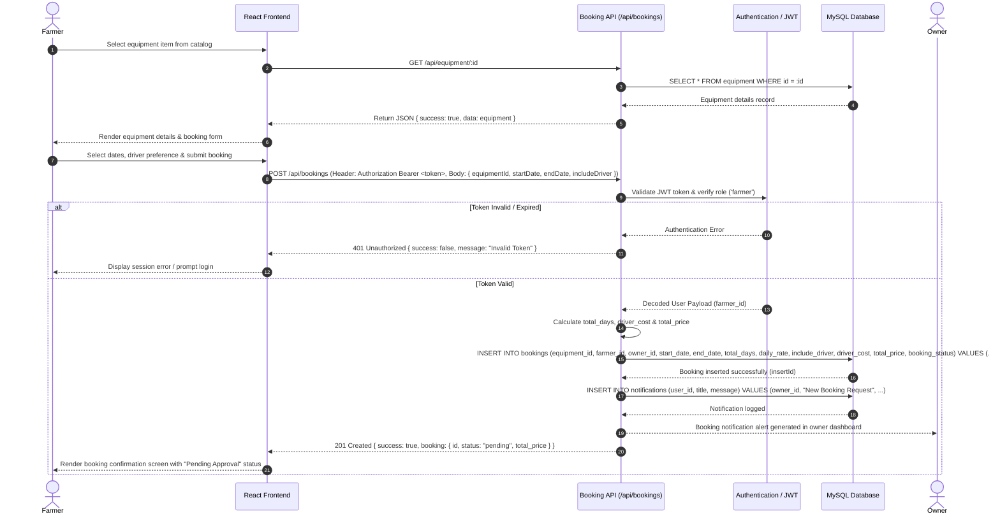

# Sequence Diagram: Farmer Creates a Rental Booking

## Overview

This Sequence diagram documents the exact interactions between system components during the core scenario: **"Farmer creates a rental booking"**. It shows HTTP request calls, JWT authentication checks, database persistence, notification triggers, and response payloads.

---

## Mermaid Sequence Diagram

---

## Sequence Execution Steps

1. **Equipment Details Request:** When a farmer clicks on an equipment listing, the frontend sends a `GET /api/equipment/:id` request. The backend retrieves the listing from MySQL and renders the details page.
2. **Booking Submission:** The farmer inputs rental start/end dates and submits the form. The frontend constructs a JSON payload and dispatches a `POST /api/bookings` request accompanied by the farmer's Bearer JWT in the request headers.
3. **JWT Authorization Guard:** The backend passes the request through the `protect` and `authorizeRoles('farmer')` middlewares to verify the token signature and identity.
4. **Calculations & Database Insertion:** The `bookingController` computes total rental days, applies daily rates and driver fees (if requested), and executes an `INSERT INTO bookings` query in MySQL.
5. **Notification Creation:** The server inserts an owner notification into the `notifications` table (`user_id = owner_id`).
6. **Frontend Confirmation:** The backend returns a `201 Created` HTTP response. The React client updates the UI to show the new booking status as `pending`.
