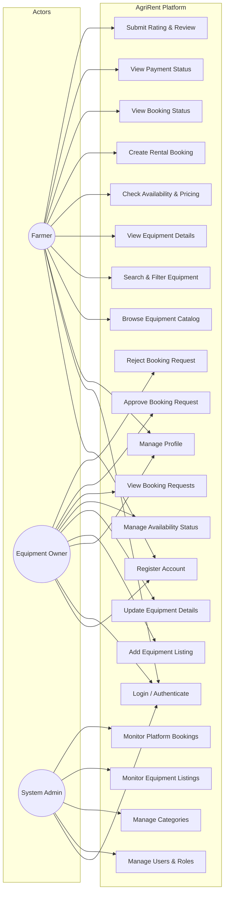

# Use Case Diagram

## Overview

The Use Case diagram illustrates the functional requirements of the **AgriRent** system from the perspective of three primary actors: **Farmer**, **Equipment Owner**, and **Admin**.

---

## Mermaid Use Case Diagram

---

## Use Case Descriptions

### 1. Farmer Use Cases
- **Browse & Search Equipment:** Search by category, name, or location to find agricultural machinery.
- **Check Availability:** View equipment rates, driver availability, and calendar availability.
- **Create Rental Booking:** Select start/end dates, choose optional driver, and submit booking request.
- **View Booking & Payment Status:** Track request status (`pending`, `approved`, `rejected`, `completed`) and view payment status.
- **Submit Review:** Submit ratings (1–5 stars) and comments after completing a rental.

### 2. Equipment Owner Use Cases
- **Add & Update Equipment:** Upload equipment details, daily rental rate, driver availability, horsepower, and location.
- **Manage Availability:** Toggle equipment status between available and unavailable.
- **Respond to Requests:** Review incoming rental requests from farmers and either **Approve** or **Reject** them.

### 3. System Admin Use Cases
- **Manage Users:** Monitor user accounts, update roles, or suspend access.
- **Manage Categories:** Create and edit equipment classification categories.
- **Monitor System Data:** Review all platform equipment listings and rental bookings for operational governance.
