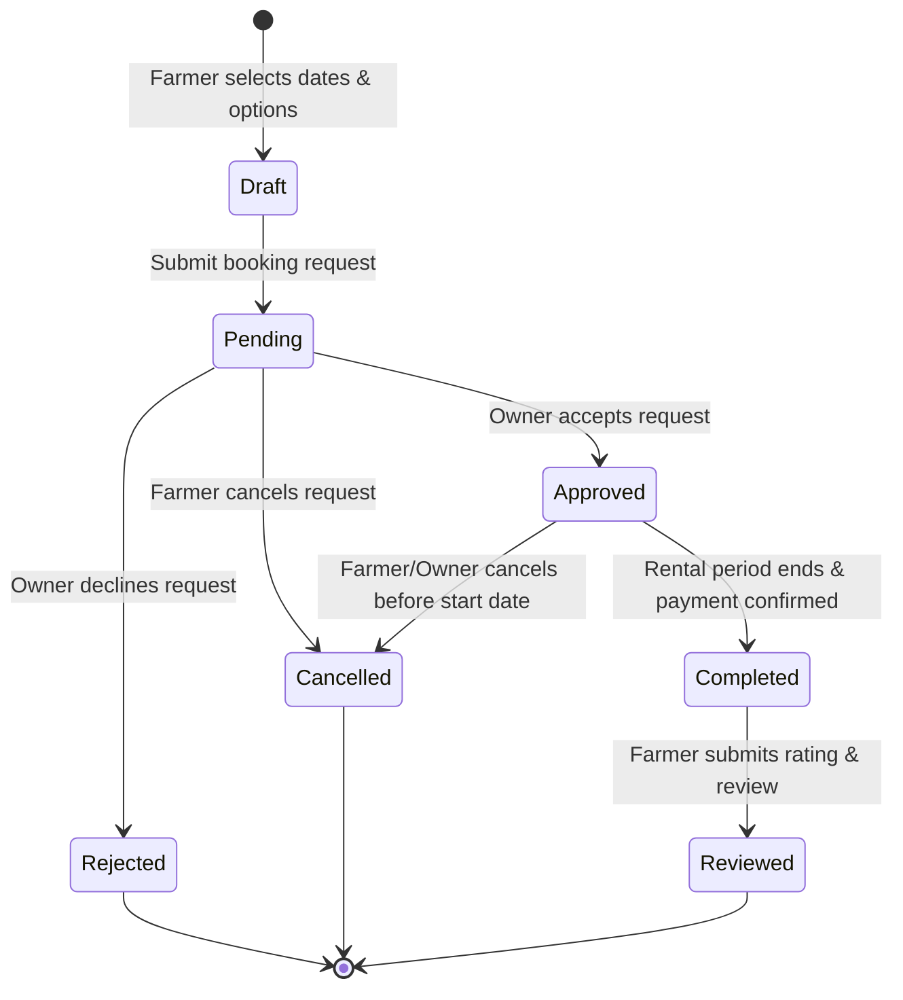

# Rental Booking Workflow Lifecycle

```mermaid
stateDiagram-v2
    [*] --> Draft: Farmer selects dates & options
    Draft --> Pending: Submit booking request
    Pending --> Approved: Owner accepts request
    Pending --> Rejected: Owner declines request
    Approved --> Completed: Rental period ends & payment confirmed
    Pending --> Cancelled: Farmer cancels request
    Approved --> Cancelled: Farmer/Owner cancels before start date
    Completed --> Reviewed: Farmer submits rating & review
    Rejected --> [*]
    Cancelled --> [*]
    Reviewed --> [*]
```
